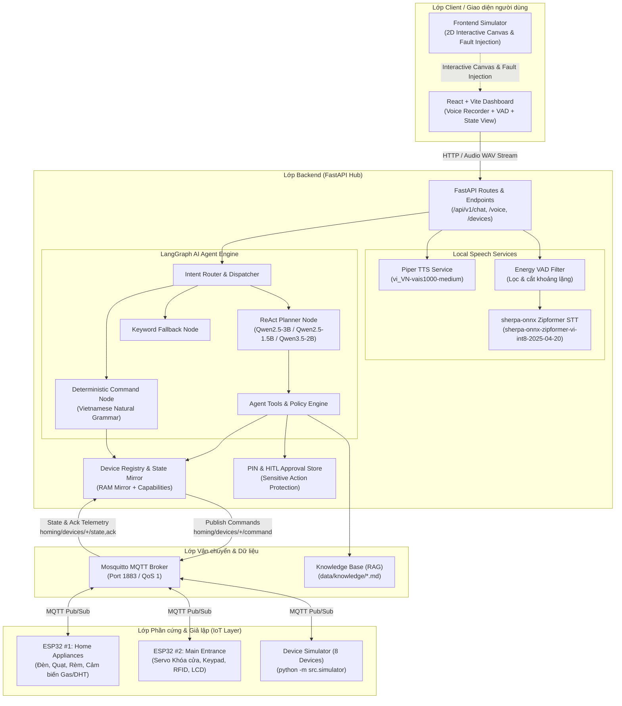
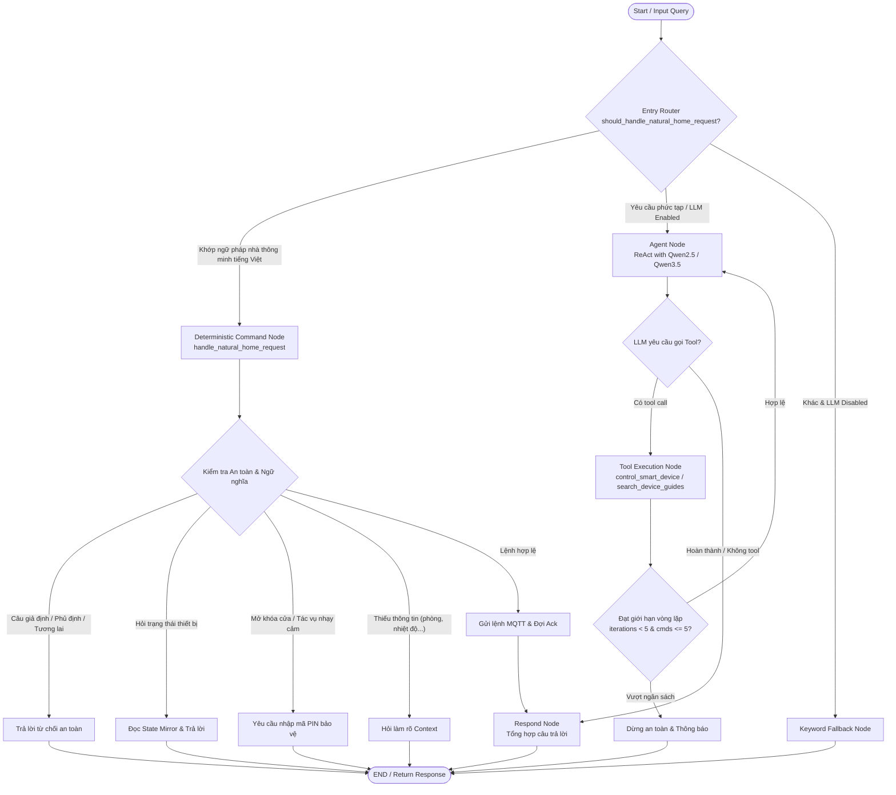

# Homing (HomeMind) Smart Home AI Agent: Architecture Document

## 1. System Overview

**Homing** (HomeMind) là hệ thống trợ lý nhà thông minh điều khiển bằng giọng nói tiếng Việt on-device / edge AI. Hệ thống tích hợp mô hình ngôn ngữ nhỏ (`Qwen2.5-3B-Instruct` / `Qwen2.5-1.5B` / `Qwen3.5-2B`, lượng tử hóa Q4_K_M qua `llama.cpp`), framework điều phối đa bước **LangGraph**, **FastAPI** backend, bộ xử lý tiếng nói cục bộ (**sherpa-onnx Zipformer** STT `sherpa-onnx-zipformer-vi-int8-2025-04-20` và **Piper** TTS `vi_VN-vais1000-medium`), cùng giao thức truyền thông **MQTT** (QoS 1) kết nối trực tiếp với phần cứng **ESP32** (`src/firmware/`) và bộ giả lập 8 thiết bị ảo (**Device Simulator** trong `src/simulator.py`).

Hệ thống được thiết kế theo nguyên lý **Vietnamese-first orchestration**, ưu tiên tính an toàn (Human-in-the-Loop PIN authentication cho các tác vụ nhạy cảm như mở khóa cửa), xử lý câu lệnh phức tạp, ngữ cảnh hội thoại đa lượt, và phản hồi trạng thái thiết bị theo thời gian thực.

---

## 2. System Architecture Diagram

---

## 3. Data Flow & End-to-End Pipeline

Hệ thống hỗ trợ 2 luồng dữ liệu chính:

### 3.1. Voice Processing Pipeline (Luồng Giọng nói)
1. **Thu âm & Frontend VAD**: Người dùng nhấn micro trên React Dashboard nói câu lệnh tiếng Việt. Frontend VAD tính toán RMS energy và tự động dừng thu âm sau 2 giây im lặng.
2. **Audio Upload**: Trình duyệt gửi file audio WAV mono PCM16 16kHz về endpoint `/api/v1/voice/transcribe`.
3. **Backend VAD & Zipformer STT**: Backend energy VAD xác nhận speech, loại bỏ nhiễu/khoảng lặng, sau đó đưa qua `sherpa-onnx Zipformer` (`sherpa-onnx-zipformer-vi-int8-2025-04-20`) để chuyển thành văn bản chuẩn (transcript). Audio buffer được giải phóng ngay sau khi xử lý.
4. **Agent Orchestration**: Transcript được đưa vào Agent Engine để phân tích ý định và lập kế hoạch thực thi.
5. **Piper TTS Phản hồi**: Văn bản kết quả được gửi sang Piper TTS service (`vi_VN-vais1000-medium`) để sinh file âm thanh WAV tiếng Việt và truyền về Dashboard phát cho người dùng.

### 3.2. Text & Device Control Pipeline (Luồng Lệnh & Điều khiển)
1. **API Ingestion**: Người dùng gửi text prompt qua `/api/v1/chat`.
2. **Intent Parsing & Validation**: Agent phân tích ý định ngữ pháp tiếng Việt (đơn lệnh, đa lệnh, câu hỏi trạng thái, câu điều kiện, câu giả định, phủ định).
3. **Safety & Policy Check**:
   - Nếu là lệnh thông thường: Thiết bị và giá trị (độ sáng, nhiệt độ) được kiểm tra qua `DeviceRegistry.validate_command()`.
   - Nếu là hành động nhạy cảm (như mở khóa cửa): Hệ thống kích hoạt quy trình xác thực mã PIN / Human-in-the-Loop, từ chối thực thi tự động trực tiếp từ giọng nói không xác thực.
4. **MQTT Dispatch**: Lệnh được đóng gói dạng JSON có `command_id` duy nhất và publish lên topic `homing/devices/{device_id}/command` với QoS 1.
5. **Hardware Execution & Ack**: ESP32 / Simulator nhận lệnh, cập nhật phần cứng, rồi phản hồi telemetry qua `homing/devices/{device_id}/ack` và `state`.
6. **Hub State Mirror**: Hub nhận Ack qua MQTT, cập nhật state mirror trong RAM và trả lời xác nhận đến người dùng.

---

## 4. LangGraph Agent Workflow Diagram

Luồng xử lý quyết định và an toàn của LangGraph Agent:

---

## 5. Detailed Component Descriptions

### 5.1. Frontend Layer
- **React + Vite Dashboard (`frontend/`)**: Giao diện điều khiển thời gian thực kết hợp thu âm tiếng nói bằng trình duyệt (Web Audio API), tích hợp Frontend VAD lọc khoảng lặng, hiển thị trực quan các thẻ thiết bị (đèn, quạt, điều hòa, rèm, khóa cửa, cảm biến), và nhật ký hội thoại (chat & audio playback).
- **Frontend Simulator (`frontend-simulator/`)**: Bản mô phỏng 2D canvas trực quan, hỗ trợ điều khiển và tiêm lỗi (fault injection: `offline`, `timeout`, `none`) qua MQTT.

### 5.2. Backend Layer (FastAPI Hub)
- **FastAPI Hub (`src/main.py`, `src/api/routes.py`)**: Trung tâm điều phối toàn bộ hệ thống qua RESTful API, quản lý lifecycle của MQTT client, Speech Runtime và LangGraph agent.
- **Pydantic Validation (`src/models/schemas.py`)**: Ràng buộc dữ liệu cho thiết bị, trạng thái, payload âm thanh và yêu cầu điều khiển.

### 5.3. Local Speech Services
- **sherpa-onnx Zipformer STT (`src/services/speech.py`)**: Bộ nhận dạng giọng nói tiếng Việt chạy CPU tối ưu lượng tử hóa int8 (`sherpa-onnx-zipformer-vi-int8-2025-04-20`). Tích hợp Energy VAD server-side và cơ chế Thread Lock để đồng bộ hóa tài nguyên xử lý âm thanh.
- **Piper TTS Service (`infra/piper/`)**: Container tổng hợp giọng nói tiếng Việt (`vi_VN-vais1000-medium`) tạo file WAV với độ trễ thấp (<1s).

### 5.4. LangGraph Agent Engine
- **State Graph (`src/agents/graph.py`, `src/agents/state.py`)**: Đồ thị trạng thái xử lý logic suy luận đa bước, tích hợp router chuyển đổi giữa ReAct Agent (`Qwen2.5-3B-Instruct` / `Qwen2.5-1.5B` / `Qwen3.5-2B` qua `llama.cpp`) và Deterministic Grammar Engine.
- **Tools (`src/agents/tools/smart_home_tools.py`)**: Cung cấp các công cụ:
  * `control_smart_device`: Điều khiển thiết bị thông minh qua MQTT.
  * `query_device_state`: Đọc trạng thái cảm biến và thiết bị thời gian thực.
  * `search_device_guides`: Tra cứu tài liệu hướng dẫn sử dụng và an toàn (RAG).

### 5.5. MQTT & Hardware Layer
- **Mosquitto MQTT Broker**: Kênh truyền thông Pub/Sub nội bộ nhẹ, tách biệt dữ liệu điều khiển IoT khỏi luồng âm thanh (Port 1883, QoS 1, topics `homing/devices/{device_id}/command`, `state`, `ack`, `fault`).
- **ESP32 Firmware (`src/firmware/`)**:
  * `esp32_home_appliances`: Quản lý relay đèn các phòng, quạt PWM, servo cửa sổ thông gió, cảm biến gas MQ2, DHT11 nhiệt độ/độ ẩm, cảm biến chuyển động PIR, cảm biến ánh sáng LDR và màn hình LCD.
  * `esp32_main_entrance`: Quản lý servo khóa cửa an ninh, bàn phím số ma trận Keypad 4x4, đầu đọc RFID RC522, còi Buzzer cảnh báo và màn hình LCD I2C.
- **Device Simulator (`src/simulator.py`)**: Mô phỏng 8 thiết bị IoT ảo phản hồi state telemetry và ack mà không yêu cầu cắm phần cứng vật lý.

---

## 6. Security & Safety Principles

1. **PIN Code & Human-in-the-Loop (HITL)**: Các hành vi an ninh cấp cao (như mở khóa cửa `entry-lock`) yêu cầu xác thực mã PIN bảo vệ hoặc phê duyệt trong ứng dụng (Approval queue), ngăn chặn các cuộc tấn công phát âm thanh giả mạo (audio replay attacks).
2. **State & Schema Validation**: Mọi lệnh điều khiển đều qua kiểm tra kiểu dữ liệu, biên giá trị (ví dụ: nhiệt độ 16-30°C, độ sáng 0-100%) và trạng thái thiết bị (`online/offline`) trước khi publish lên MQTT.
3. **Execution Budgeting**: Giới hạn tối đa 5 vòng lặp ReAct và tối đa 5 thiết bị thay đổi trong một lượt để ngăn ngừa hiện tượng lặp vô tận hoặc quá tải hạ tầng.
4. **Context & Guardrail Rules**: Tự động nhận diện và từ chối các câu lệnh giả định (*"Nếu tôi bảo bật đèn..."*), câu phủ định (*"Đừng tắt điều hòa"*), hoặc các câu lệnh hoãn (*"Tối nay bật đèn..."*) đòi hỏi tính năng đặt lịch.
5. **Local Environment Isolation**: Không yêu cầu gửi dữ liệu âm thanh hoặc thông tin gia đình lên cloud bên thứ ba; hoạt động hoàn toàn trong mạng nội bộ (On-Device Edge Architecture).

---

## 7. Design Decisions

| Quyết định thiết kế | Lựa chọn công nghệ | Lý do & Đánh giá kỹ thuật |
|---|---|---|
| **AI Agent Framework** | **LangGraph** | State Machine dạng đồ thị, quản lý vòng lặp ReAct, Human-in-the-Loop và fallback node khi không có GPU. |
| **Backend Framework** | **FastAPI** | Bất đồng bộ (async/await), hiệu năng cao, tự động sinh OpenAPI docs, tương thích native với Pydantic validation. |
| **STT Engine** | **sherpa-onnx Zipformer (int8)** | Nhận diện tiếng Việt on-device chạy CPU (`sherpa-onnx-zipformer-vi-int8-2025-04-20`), RAM tiêu thụ thấp (~150MB), không phụ thuộc cloud API. |
| **TTS Engine** | **Piper TTS** | Giọng đọc tiếng Việt (`vi_VN-vais1000-medium`), độ trễ sinh âm thanh <1s, chạy container cục bộ. |
| **IoT Protocol** | **MQTT (Mosquitto)** | Băng thông thấp, hỗ trợ QoS 1 và Retained State, giao tiếp trực tiếp với vi điều khiển ESP32. |
| **Hardware Platform** | **ESP32 SoC** | Chi phí hợp lý, tích hợp sẵn Wi-Fi/Bluetooth, hỗ trợ GPIO, I2C, SPI kết nối cảm biến và cơ cấu chấp hành. |
| **Deterministic Grammar** | **Regex + Phonetic Normalizer** | Xử lý tức thì (<50ms) các câu lệnh điều khiển tiếng Việt phổ biến, đảm bảo hệ thống hoạt động chính xác kể cả khi tắt LLM. |
| **Testing Architecture** | **Pytest + Mocked Simulator** | Bộ kiểm thử tự động gồm 463 passed, 1 skipped cho các luồng an toàn, ngữ nghĩa tiếng Việt, xử lý âm thanh và giao tiếp MQTT. |

## 8. Agent Rollout Contract

Entrypoint chọn `legacy_active` hoặc `typed_shadow` theo cấu hình; `typed_shadow` không tạo graph typed và không publish. `typed_active` chỉ được chọn khi các gate enabled, capability và artifact đều bật; thiếu bất kỳ gate nào sẽ quay về legacy. Hai chế độ dùng chung validator, policy, idempotency và verification contract. Rollback chỉ cần chọn lại `legacy_active`.
