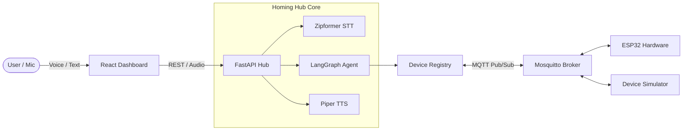

# Homing (HomeMind): Trợ lý Nhà thông minh Điều khiển bằng Giọng nói Tiếng Việt với AI Agent và IoT

[]()
[]()
[]()
[]()
[]()
[]()

> **Homing** là giải pháp nhà thông minh AI Agent điều khiển bằng giọng nói tiếng Việt cục bộ (On-Device / Edge AI). Dự án tích hợp nhận diện tiếng nói (sherpa-onnx Zipformer `sherpa-onnx-zipformer-vi-int8-2025-04-20`), tổng hợp giọng nói (Piper TTS `vi_VN-vais1000-medium`), bộ điều phối suy luận đa bước LangGraph, giao thức MQTT (QoS 1) và phần cứng vi điều khiển ESP32 kèm bộ giả lập 8 thiết bị ảo.

---

## Tính năng Nổi bật

- **Điều khiển Giọng nói Tiếng Việt Cục bộ (Edge STT & TTS)**:
  - Nhận diện giọng nói chạy CPU với **sherpa-onnx Zipformer** (`sherpa-onnx-zipformer-vi-int8-2025-04-20`, int8).
  - Tổng hợp giọng nói phản hồi qua **Piper TTS** (`vi_VN-vais1000-medium`).
  - Tích hợp **Voice Activity Detection (VAD)** ở cả frontend và backend để tự động cắt khoảng lặng và lọc nhiễu.
- **AI Agent Suy luận Đa bước và Đa lượt (LangGraph Orchestration)**:
  - Xử lý câu lệnh đơn, đa lệnh kết hợp (*"Tắt hết đèn và chỉnh điều hòa phòng khách 24 độ"*), câu hỏi làm rõ (clarification context) và đại từ thay thế.
  - Phân tích ngữ nghĩa tiếng Việt: từ chối các câu giả định, phủ định hoặc câu lệnh hoãn trong tương lai.
  - Hỗ trợ chế độ ReAct với mô hình ngôn ngữ (`Qwen2.5-3B-Instruct` / `Qwen2.5-1.5B` / `Qwen3.5-2B`, lượng tử hóa Q4_K_M qua `llama.cpp`) và bộ phân tích ngữ pháp tiền định (Deterministic Engine) độ trễ thấp (<50ms).
- **Bảo mật và Xác thực An toàn (PIN Code & HITL)**:
  - Tác vụ an ninh (như mở khóa cửa `entry-lock`) yêu cầu xác thực mã PIN bảo vệ hoặc phê duyệt qua giao diện, ngăn ngừa phát lệnh ngoài ý muốn.
- **Giao thức IoT Chuẩn hóa và Tích hợp Phần cứng ESP32**:
  - Giao tiếp qua **Mosquitto MQTT** với cơ chế QoS 1, Retained State và Acknowledgment telemetry (các topic `homing/devices/{device_id}/command`, `state`, `ack`, `fault`).
  - Firmware ESP32 cho thiết bị gia dụng và cụm cổng khóa an ninh (Keypad 4x4, RFID RC522, LCD I2C, Servo, Buzzer) trong `src/firmware/`.
  - Tích hợp sẵn **Device Simulator** (`src/simulator.py`) chạy độc lập mô phỏng 8 thiết bị ảo, giúp kiểm thử toàn bộ hệ thống không cần phần cứng.
- **Bảng điều khiển Thời gian thực (Interactive Dashboard & Simulator)**:
  - Giao diện React Dashboard (`frontend/`) cho phép thao tác bật/tắt, kéo thanh trượt độ sáng/nhiệt độ, thu âm giọng nói và theo dõi log phản hồi.
  - Virtual Home Simulator (`frontend-simulator/`) hỗ trợ mô phỏng mặt bằng 2D Canvas và tiêm lỗi (fault injection).

---

## Kiến trúc và Ngăn xếp Công nghệ



| Tầng hệ thống | Công nghệ sử dụng | Vai trò chi tiết |
|---|---|---|
| **Frontend** | React 18, Vite, TypeScript, TailwindCSS | Giao diện điều khiển (`frontend/`) và mô phỏng 2D Canvas (`frontend-simulator/`) |
| **Backend API** | FastAPI, Uvicorn, Pydantic v2 | Hub điều phối REST API, streaming audio, quản lý state mirror |
| **Speech-to-Text** | `sherpa-onnx` Zipformer (`sherpa-onnx-zipformer-vi-int8-2025-04-20`) | STT tiếng Việt on-device, tiêu thụ RAM thấp (~150MB) |
| **Text-to-Speech** | Piper TTS Service (`vi_VN-vais1000-medium`) | Tổng hợp âm thanh WAV tiếng Việt độ trễ thấp (<1s) |
| **AI Orchestration** | LangGraph, LangChain, Qwen2.5-3B-Instruct / Qwen2.5-1.5B / Qwen3.5-2B (Q4_K_M) | Đồ thị trạng thái ReAct, định tuyến ý định, quản lý công cụ |
| **IoT Protocol** | Eclipse Mosquitto MQTT Broker (Port 1883, QoS 1) | Kênh truyền thông Pub/Sub điều khiển thiết bị (`command`, `state`, `ack`, `fault`) |
| **Phần cứng IoT** | ESP32 SoC, C++ / Arduino Framework (`src/firmware/`) | Điều khiển relay, servo, cảm biến gas MQ2, DHT11, RFID |
| **Bộ giả lập IoT** | Python Device Simulator (`src/simulator.py`) | Mô phỏng 8 thiết bị ảo qua MQTT |
| **Testing** | Pytest, Pytest-asyncio, Mocked MQTT | Bộ kiểm thử tự động gồm 463 passed, 1 skipped |

---

## Hướng dẫn Cài đặt và Khởi chạy

### 1. Yêu cầu Tiên quyết (Prerequisites)
- **Hệ điều hành**: Linux (Ubuntu 20.04+), macOS, hoặc Windows (WSL2 / Docker Desktop).
- **Phần mềm**: Docker Engine & Docker Compose v2, Python 3.11+, `curl`, `tar`, `sha256sum`.

### 2. Tải Voice Models và Cấu hình Môi trường

```bash
# Clone repository (SSH hoặc HTTPS)
git clone git@github.com:AI20K-Build-Phase-Cohort-3/P-140.git homing-hub
cd homing-hub

# Tạo file cấu hình môi trường
cp .env.example .env

# Tải các mô hình Zipformer STT và Piper TTS tiếng Việt (tự động kiểm tra checksum)
bash scripts/download_voice_models.sh
```

### 3. Chạy qua Docker Compose (Khuyến nghị)

Sử dụng script `scripts/docker.sh` để khởi động các chế độ mong muốn:

```bash
# Chạy toàn bộ hệ thống (Frontend, Backend, MQTT, Simulator, Zipformer, Piper TTS)
bash scripts/docker.sh up full

# Kiểm tra trạng thái các container
bash scripts/docker.sh ps
```

Truy cập các dịch vụ:
- **Web Dashboard**: [http://localhost/](http://localhost/)
- **FastAPI Swagger Docs**: [http://localhost:8000/docs](http://localhost:8000/docs)
- **MQTT Broker**: `localhost:1883`

Để tắt hệ thống:
```bash
bash scripts/docker.sh down
```

---

### 4. Chạy Cục bộ với Python (Local Python Setup)

Nếu muốn phát triển và kiểm tra trực tiếp:

```bash
# 1. Tạo và kích hoạt virtual environment
python3 -m venv .venv
source .venv/bin/activate

# 2. Cài đặt thư viện
pip install -r requirements.txt

# 3. Khởi động MQTT Broker & Device Simulator (hoặc chạy docker cho mqtt)
docker compose up -d mqtt

# 4. Chạy backend FastAPI
uvicorn src.main:app --host 0.0.0.0 --port 8000 --reload
```

---

## Cấu hình Môi trường (.env Guide)

File `.env` quản lý các tham số hoạt động chính của hệ thống:

```ini
# -- LLM & Reasoning ----------------------------------
LLM_ENABLED=false                           # Bật/tắt ReAct Agent với LLM (false dùng Deterministic Parser)
MODEL_NAME=qwen2.5-3b-instruct-q4_k_m.gguf
LLAMA_BASE_URL=http://localhost:8080/v1
LLM_TIMEOUT_SECONDS=12

# -- MQTT Broker --------------------------------------
MQTT_ENABLED=true
MQTT_BROKER=localhost                       # Đặt là "mqtt" khi chạy trong Docker Compose
MQTT_PORT=1883
MQTT_TOPIC_PREFIX=homing
MQTT_QOS=1
MQTT_RETAIN_STATE=true
MQTT_CLIENT_ID=homing-hub

# -- Speech Runtime (STT & TTS) -----------------------
VOICE_ENABLED=true
ZIPFORMER_MODEL_DIR=models/zipformer/sherpa-onnx-zipformer-vi-int8-2025-04-20
ZIPFORMER_NUM_THREADS=2
PIPER_ENDPOINT=http://localhost:5000        # http://piper:5000 trong Docker
PIPER_VOICE=vi_VN-vais1000-medium
TTS_TIMEOUT_SECONDS=30
VOICE_MAX_AUDIO_SECONDS=20
VOICE_MAX_AUDIO_BYTES=1000000

# -- An toàn & Bảo mật --------------------------------
SECURITY_PIN=1234                           # Mã PIN mở khóa cửa
CORS_ORIGINS=http://localhost:3000,http://localhost:5173
```

---

## Mẫu Câu Lệnh Giọng nói và Văn bản

Homing xử lý đa dạng các tình huống điều khiển bằng tiếng Việt:

1. **Điều khiển Đơn lệnh (Single-intent Device Control)**:
   > *"Bật đèn phòng khách"* hoặc *"Bật đèn phòng ngủ sáng 50%"*
   - *Hành động*: Bật relay đèn phòng khách và cập nhật độ sáng theo yêu cầu.

2. **Điều khiển Phức hợp / Đa phòng (Multi-intent Complex Command)**:
   > *"Tắt hết đèn và chỉnh điều hòa phòng khách 24 độ"*
   - *Hành động*: Gửi chuỗi lệnh tắt đồng loạt `living-light`, `bedroom-light`, `kitchen-light`, và đặt nhiệt độ `living-aircon` về 24°C.

3. **Truy vấn Trạng thái Cảm biến & Thiết bị (Status Query)**:
   > *"Nhiệt độ và độ ẩm phòng khách đang là bao nhiêu?"*
   - *Hành động*: Đọc dữ liệu cảm biến thời gian thực: *"Nhiệt độ phòng khách hiện tại là 27°C, độ ẩm 65%."*

4. **Xác thực An toàn Mở khóa Cửa (High-Security PIN Authentication)**:
   > Người dùng: *"Mở khóa cửa chính"*  
   > Homing: *"Mở khóa cần được tạo và xác nhận trong ứng dụng Homing Hub hoặc cung cấp mã PIN hợp lệ."*  
   > Người dùng: Xác nhận mã PIN `1234` trên Web Dashboard hoặc Keypad: Cửa mở thành công.

5. **Hỏi đáp Tri thức & Hướng dẫn Thiết bị (RAG / Knowledge Q&A)**:
   > *"Làm thế nào khi cảm biến phát hiện rò rỉ khí gas?"*
   - *Hành động*: Tra cứu tài liệu an toàn: Hướng dẫn người dùng khóa van bình gas, mở cửa sổ thông gió và không bật công tắc điện.

6. **Điều chỉnh Tương đối & Ngữ cảnh Tiếp nối (Contextual Follow-up)**:
   > Người dùng: *"Cho loa phòng khách to lên một chút"*  
   > Homing: Tăng âm lượng `hub-speaker` thêm 10%.  
   > Người dùng: *"Tắt nó đi"* : Tự động nhận biết đại từ *"nó"* tương ứng với `hub-speaker` và tắt loa.

---

## Kiểm thử và Chạy Simulator

### 1. Chạy Bộ Kiểm thử (Pytest Suite)
Bộ kiểm thử tự động gồm 463 passed, 1 skipped bao quát API, Agent Logic, Speech Services, An toàn Ngữ nghĩa và MQTT transport:

```bash
# Kích hoạt venv và chạy pytest (loại trừ test live model và phần cứng thực tế)
pytest tests/ -v -m "not live_model and not hardware"
```

### 2. Chạy Độc lập Device Simulator
Bộ giả lập mô phỏng 8 thiết bị IoT phản hồi MQTT state và ack như phần cứng thật:

```bash
# Chạy simulator kết nối với broker localhost
MQTT_BROKER=localhost python -m src.simulator
```

---

## Cấu trúc Thư mục Dự án

```text
├── src/
│   ├── agents/               # LangGraph Agent, State graph, Nodes & Tools
│   │   ├── graph.py          # StateGraph pipeline & routing
│   │   ├── state.py          # Schema trạng thái AgentState
│   │   └── tools/            # Smart home tools (@tool)
│   ├── api/                  # FastAPI REST routes & audio streaming endpoints
│   ├── firmware/             # Mã nguồn C++/Arduino cho vi điều khiển ESP32
│   ├── models/               # Pydantic schemas (Device, Command, State, Audio)
│   ├── services/             # Logic nghiệp vụ: Speech, MQTT, Device Registry, Safety
│   ├── config.py             # Cấu hình Pydantic Settings
│   ├── main.py               # Điểm khởi chạy FastAPI Hub
│   └── simulator.py          # Virtual Device Simulator qua MQTT (8 thiết bị)
├── frontend/                 # React + Vite Dashboard thời gian thực
├── frontend-simulator/       # 2D Canvas Virtual Home Simulator & Fault Injection
├── infra/                    # Mosquitto config, Piper Dockerfile
├── docs/                     # Tài liệu kỹ thuật, sơ đồ kiến trúc, firmware guide
├── eval/                     # Báo cáo đánh giá chất lượng và test cases
├── tests/                    # 463 passed, 1 skipped Unit & Integration tests
├── docker-compose.yml        # Docker Compose triển khai toàn bộ dịch vụ
└── requirements.txt          # Danh sách dependencies Python
```

---

## Đội ngũ Phát triển và Bản quyền

- **Dự án**: VinUni AI20K Build Phase: Homing Hub Project.
- **Kho lưu trữ**: [git@github.com:AI20K-Build-Phase-Cohort-3/P-140.git](https://github.com/AI20K-Build-Phase-Cohort-3/P-140)
- **Giấy phép**: [MIT License](LICENSE).

## Agent Rollout Contract

`legacy_active` và `typed_shadow` dùng pipeline legacy; shadow không tạo graph typed và không publish. `typed_active` chỉ chạy khi các gate enabled, capability và artifact đều hợp lệ, nếu không sẽ tự động quay về legacy. Hai chế độ dùng chung validator, policy, idempotency và verification contract.
