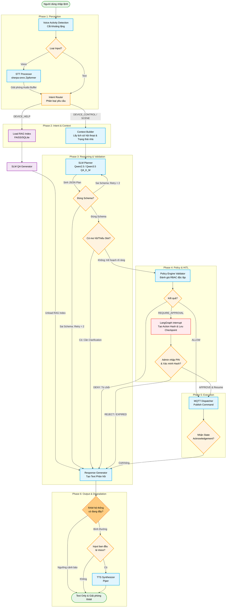

# Homing Hub AI Agent Flow and System Architecture

## 1. Tổng quan Quy trình

Tài liệu này mô tả luồng xử lý của **Homing Hub AI Agent** trong hệ thống nhà thông minh cục bộ (Edge AI / On-Device). Quy trình gồm 6 giai đoạn từ khi thu nhận tín hiệu đầu vào cho đến khi thực thi thiết bị qua MQTT và phản hồi người dùng.

---

## 2. Sơ đồ Luồng AI Agent

---

## 3. Chi tiết các Giai đoạn

### Phase 1: Perception (Thu nhận và Tiền xử lý Đầu vào)
- **VAD (Voice Activity Detection)**: Nhận diện khoảng lặng để cắt audio stream và lọc nhiễu nền.
- **Router Input**: Phân loại định dạng đầu vào:
  - **Voice Input**: Chuyển tới **STT Processor (sherpa-onnx Zipformer `sherpa-onnx-zipformer-vi-int8-2025-04-20`)** để nhận dạng giọng nói tiếng Việt thành văn bản. Giải phóng Audio Buffer ngay sau khi chuyển đổi xong để tránh chiếm dụng bộ nhớ.
  - **Text Input**: Bỏ qua bước STT và chuyển thẳng tới bộ phân loại ý định (Intent Router).

### Phase 2: Intent & Context (Định tuyến Ý định và Ngữ cảnh)
- **Intent Router**: Phân tích câu lệnh để xác định nhóm xử lý:
  - **`DEVICE_HELP`**: Nạp chỉ mục RAG (**FAISS/SQLite**) để tra cứu tài liệu hướng dẫn sử dụng thiết bị. Giải phóng chỉ mục RAG khỏi bộ nhớ sau khi hoàn thành câu trả lời.
  - **`DEVICE_CONTROL` / `SCENE`**: Chuyển tới **Context Builder** để tổng hợp 5-10 lượt hội thoại gần nhất cùng trạng thái thời gian thực của thiết bị.

### Phase 3: Reasoning & Validation (Lập kế hoạch và Xác thực)
- **SLM Planner (`Qwen2.5-3B-Instruct` / `Qwen2.5-1.5B` / `Qwen3.5-2B` Q4_K_M)**: Mô hình ngôn ngữ nhỏ tối ưu hóa cho phần cứng Edge, lập kế hoạch thực thi dưới dạng JSON.
- **Schema Check**:
  - Đối chiếu JSON được sinh ra với JSON Schema chuẩn.
  - **Cơ chế Retry**: Nếu sai Schema, hệ thống cho phép thử lại tối đa 2 lần. Nếu vẫn không hợp lệ ở lần 2, chuyển sang xử lý phản hồi lỗi.
- **Ambiguity Check**: Kiểm tra câu lệnh có thiếu thông số (phòng, thiết bị, giá trị) hay không. Khi phát hiện thiếu dữ liệu, gửi câu hỏi làm rõ đến người dùng.

### Phase 4: Policy & HITL (Kiểm tra An toàn và Phê duyệt)
- **Policy Engine Validator**: Kiểm tra chính sách an toàn độc lập (RBAC, giới hạn quyền, kiểm tra tham số biên).
- **Phân luồng Kết quả**:
  - `DENY`: Từ chối thực thi do vi phạm quy định an toàn.
  - `REQUIRE_APPROVAL`: Kích hoạt cơ chế **Human-in-the-Loop (HITL)** qua LangGraph Interrupt. Hệ thống tạo **Action Hash** và lưu **Checkpoint**, yêu cầu người dùng nhập mã PIN xác thực để phê duyệt.

### Phase 5: Execution (Thực thi Mạng nội bộ)
- **MQTT Dispatcher**: Phát lệnh điều khiển đã phê duyệt tới các thiết bị IoT qua giao thức MQTT (QoS 1, topic `homing/devices/{id}/command`).
- **State Acknowledgement**: Lắng nghe phản hồi xác nhận trạng thái (`ack` và `state`) từ thiết bị để cập nhật state mirror trước khi hoàn tất phản hồi.

### Phase 6: Output & Degradation (Phản hồi và Giảm tải Hệ thống)
- **Response Generator**: Tổng hợp nội dung văn bản phản hồi cho người dùng.
- **RAM Check**: Giám sát dung lượng RAM hệ thống trước khi phát âm thanh:
  - **RAM vượt ngưỡng cảnh báo**: Kích hoạt chế độ suy hao năng lực (Graceful Degradation): gửi phản hồi dạng văn bản (Text Only) và giải phóng RAM.
  - **RAM ở mức an toàn**: Khi yêu cầu ban đầu là giọng nói, chuyển phản hồi qua **TTS Synthesizer (Piper `vi_VN-vais1000-medium`)** để xuất âm thanh.

---

## 4. Quy tắc Vận hành và Quản lý Tài nguyên Cục bộ

1. **Giải phóng Audio Buffer**: Giải phóng bộ nhớ âm thanh ngay sau khi chuyển đổi giọng nói thành văn bản qua Zipformer.
2. **Vòng đời RAG Index**: Chỉ tải chỉ mục RAG khi cần thiết và dọn khỏi RAM ngay sau khi sinh câu trả lời (`DEVICE_HELP`).
3. **Giới hạn Retry Schema**: Tối đa 2 lần thử lại cho planner khi sinh JSON sai định dạng nhằm tránh lặp vô hạn.
4. **Xác thực HITL**: Lưu checkpoint trạng thái và kiểm tra chữ ký Hash kèm mã PIN với các thao tác an ninh.
5. **Suy hao mềm (Degradation)**: Tự động ngắt TTS và chuyển sang Text Only khi bộ nhớ RAM đạt ngưỡng cảnh báo.
6. **Agent rollout**: Entry point đọc runtime settings. `legacy_active` và `typed_shadow` chọn legacy; shadow không dựng typed graph nên không gửi lệnh thực thi hay publish. `typed_active` chỉ chọn typed khi đủ enabled, capability và artifact; thiếu bất kỳ điều kiện nào sẽ quay về legacy. Cả hai dùng chung validator, policy, idempotency ledger và verification contract. Rollback thực hiện bằng cách chuyển selector về `legacy_active`.
