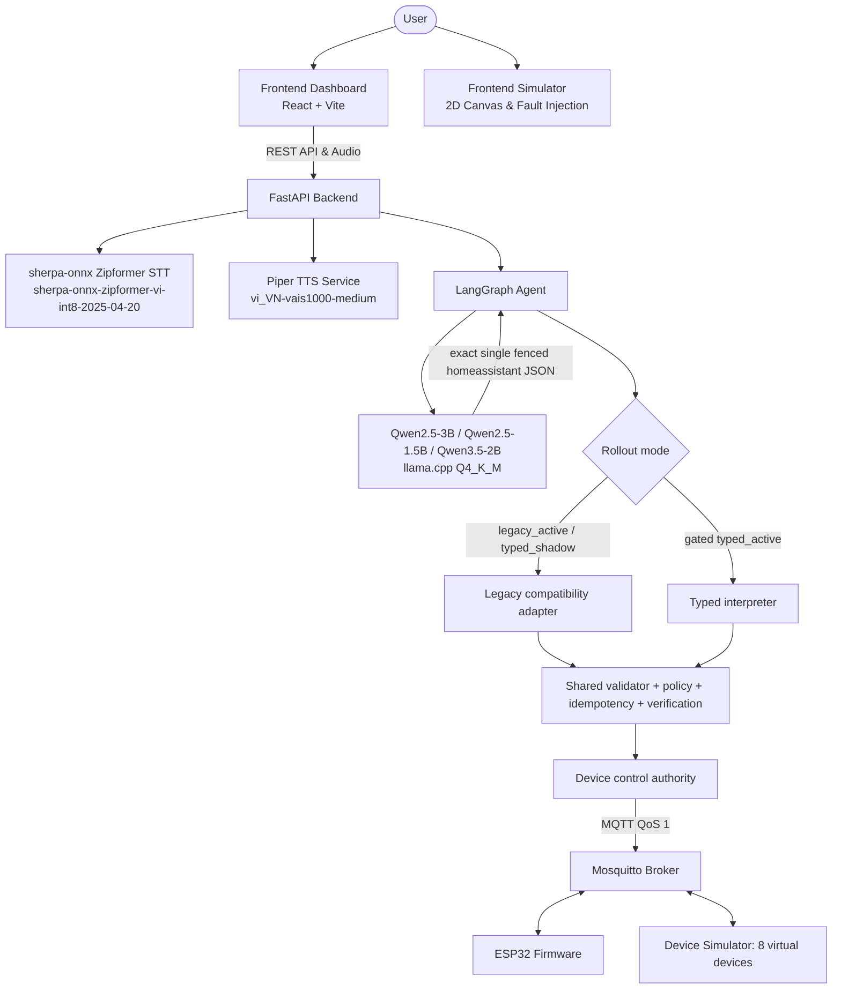
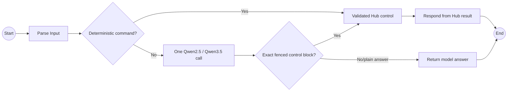

# Architecture Diagram

## System Overview

## Agent Flow

## Component Details

| Component | Technology | Purpose |
|---|---|---|
| Frontend | React 18, Vite, TypeScript (`frontend/`) | User dashboard, Web Audio recorder, state view |
| Frontend Simulator | 2D Canvas Interactive (`frontend-simulator/`) | Virtual home floor plan and MQTT fault injection |
| Backend | FastAPI, Uvicorn, Pydantic v2 | API server, voice streaming, device registry |
| Speech-to-Text | `sherpa-onnx` Zipformer (`sherpa-onnx-zipformer-vi-int8-2025-04-20`) | On-device Vietnamese speech recognition |
| Text-to-Speech | Piper TTS (`vi_VN-vais1000-medium`) | Local Vietnamese voice synthesis |
| Agent | LangGraph | State graph orchestration and routing |
| LLM | `Qwen2.5-3B-Instruct` / `Qwen2.5-1.5B` / `Qwen3.5-2B` (Q4_K_M via `llama.cpp`) | Local reasoning; single fenced control block |
| Control authority | Registry validation + Hub (`src/services/devices.py`) | Device capability checks and execution |
| Transport & IoT | Mosquitto MQTT Broker (QoS 1) | Topics: `command`, `state`, `ack`, `fault` |
| Hardware & Simulation | ESP32 SoC (`src/firmware/`) & 8 virtual devices (`src/simulator.py`) | Physical actuators/sensors and virtual home devices |
| Rollout | `legacy_active` / `typed_shadow` / gated `typed_active` | Only active mode publishes; typed remains disabled without enabled, capability, and artifact gates |
| Testing | Pytest (`pytest tests/ -v -m "not live_model and not hardware"`) | Automated test suite: 463 passed, 1 skipped |
| Database | SQLite | State and automation persistence |
