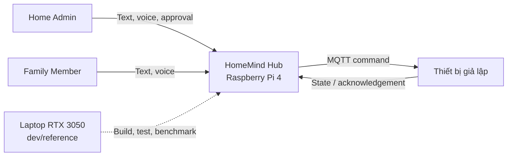

# HomeMind Hub - Project Brief

| Thuộc tính | Nội dung |
| --- | --- |
| Sản phẩm | HomeMind Hub |
| Đề tài | Trợ lý điều khiển nhà thông minh bằng ngôn ngữ tự nhiên chạy trên edge hub |
| Nền tảng nghiệm thu | Raspberry Pi 4 Model B, RAM 4GB |
| Môi trường phát triển | Laptop RAM 16GB, NVIDIA RTX 3050 |
| Định hướng | Offline-first, bảo vệ riêng tư, điều khiển bằng tiếng Việt |
| Trạng thái | Draft để triển khai MVP |
| Cập nhật lần cuối | 2026-08-02 |

> Các chỉ số hiệu năng trong tài liệu là mục tiêu cần kiểm chứng bằng benchmark thực tế, không phải kết quả được bảo đảm trước.

## Kiểm soát tài liệu

| Phiên bản | Ngày | Thay đổi | Người phụ trách |
| --- | --- | --- | --- |
| 1.0 | 2026-08-02 | Chuẩn hóa Project Brief từ phạm vi đã thống nhất | Nhóm HomeMind Hub |

**Đối tượng đọc:** nhóm sản phẩm, phát triển, kiểm thử, giảng viên/hội đồng nghiệm thu và người vận hành demo.

## 1. Tổng quan

HomeMind Hub là trợ lý AI điều khiển nhà thông minh bằng tiếng Việt, chạy trong mạng gia đình trên Raspberry Pi 4. Các chức năng cốt lõi không phụ thuộc vào dịch vụ cloud; giọng nói, nội dung hội thoại và trạng thái thiết bị được xử lý cục bộ.

Người dùng có thể nhập hoặc nói yêu cầu tự nhiên, ví dụ:

> “Tối nay có khách, bật đèn phòng khách màu ấm, mở nhạc nhẹ và đặt điều hòa 26 độ.”

Hệ thống chuyển yêu cầu thành kế hoạch có cấu trúc, xác thực tham số, kiểm tra quyền và chính sách an toàn, yêu cầu con người phê duyệt khi cần, sau đó điều khiển thiết bị giả lập qua MQTT.

## 2. Vấn đề cần giải quyết

Các hệ thống nhà thông minh phổ biến còn bốn hạn chế:

- Mỗi nhóm thiết bị thường cần một ứng dụng riêng.
- Trợ lý giọng nói phụ thuộc Internet và dịch vụ cloud.
- Dữ liệu giọng nói và thói quen sinh hoạt có thể rời khỏi mạng gia đình.
- Hệ thống có thể hiểu sai hoặc tự thực hiện hành động nhạy cảm.

HomeMind Hub cung cấp một giao diện tiếng Việt thống nhất, giữ dữ liệu trong mạng nội bộ và tách quyết định an toàn khỏi mô hình ngôn ngữ.

## 3. Mục tiêu sản phẩm

MVP phải chứng minh được rằng Raspberry Pi 4 4GB có thể:

1. Nhận lệnh tiếng Việt bằng văn bản và giọng nói.
2. Lập kế hoạch điều khiển một hoặc nhiều thiết bị.
3. Hỏi lại khi thiếu phòng, thiết bị hoặc tham số quan trọng.
4. Kiểm tra schema, quyền và chính sách trước khi thực thi.
5. Dừng hành động nhạy cảm để chờ Admin phê duyệt.
6. Điều khiển thiết bị giả lập qua MQTT và nhận xác nhận trạng thái.
7. Hoạt động khi mất kết nối WAN.
8. Đo chất lượng, độ trễ, bộ nhớ và độ ổn định nhiệt.

### Phi mục tiêu

MVP không nhằm cung cấp một smart-home platform production hoàn chỉnh, điều khiển từ Internet, nhận dạng người dùng bằng giọng nói hoặc tự động hóa hành động an ninh không có phê duyệt. Những hạng mục này thuộc phần ngoài MVP ở mục 5.

## 4. Người dùng

### Home Admin

Admin có thể điều khiển toàn bộ thiết bị, quản lý thành viên, phòng, scene và cấu hình hệ thống; xem audit log, metrics; đồng thời phê duyệt hoặc từ chối hành động nhạy cảm.

### Family Member

Family Member có thể điều khiển thiết bị sinh hoạt, chạy scene được cấp quyền, gửi lệnh text/voice, xem trạng thái nhà và trả lời câu hỏi làm rõ. Thành viên không được thay đổi quyền, xóa audit log hoặc tự phê duyệt hành động nhạy cảm.

## 5. Phạm vi MVP

### Bắt buộc

- Đăng nhập cục bộ với vai trò `ADMIN` và `MEMBER`.
- Điều khiển tối thiểu năm nhóm thiết bị: đèn, điều hòa, rèm, loa và khóa cửa giả lập.
- Nhận lệnh tiếng Việt bằng text và voice.
- Xử lý lệnh một bước và lệnh có ít nhất ba hành động.
- Hỏi lại khi yêu cầu thiếu thông tin hoặc có nhiều cách hiểu.
- HITL trước thao tác mở khóa cửa và tắt hệ thống an ninh.
- Tạo, xem trước và chạy scene.
- Lưu trạng thái nhà, command trace và ngữ cảnh hội thoại ngắn hạn.
- Hoạt động khi WAN bị chặn.
- Ghi latency, RAM, nhiệt độ và kết quả tool call.
- Có bộ evaluation cho intent, slot, task và safety.

### Nếu còn thời gian

- Preference memory có sự đồng ý của người dùng.
- RAG nhẹ cho hướng dẫn thiết bị.
- Gợi ý automation dựa trên hành vi.
- TTS streaming.
- Thử nghiệm PhoWhisper so với Whisper multilingual.
- Dashboard so sánh benchmark Pi và laptop.

### Ngoài MVP

- Multi-agent thực sự, camera AI và voice biometrics.
- Matter controller production, nhiều hub vật lý và điều khiển từ Internet.
- OTA A/B partition thực tế.
- AI tự phê duyệt hoặc tự thực hiện hành động nhạy cảm.
- ChromaDB chạy thường trực trên Pi.
- Qwen2.5-3B chạy đồng thời với toàn bộ voice pipeline trên Pi 4.

## 6. Giải pháp đề xuất

| Thành phần | Công nghệ / vai trò |
| --- | --- |
| Giao diện | React production build cho Dashboard, Assistant và Admin |
| Backend | FastAPI cung cấp REST API, WebSocket và xác thực |
| Agent | LangGraph điều phối planning, clarification, policy và HITL |
| SLM | `llama.cpp` chạy Qwen2.5-1.5B-Instruct GGUF Q4_K_M |
| STT | `sherpa-onnx` 1.13.4 với Zipformer Vietnamese INT8 chạy trong FastAPI |
| TTS | Piper-compatible runtime và giọng Việt được đánh giá thực nghiệm |
| Thiết bị | Mosquitto MQTT và device simulator |
| Dữ liệu | SQLite cho user, state, history, checkpoint và memory |
| An toàn | Schema validator, RBAC, policy engine, tool whitelist và approval |

Qwen2.5-3B chỉ là cấu hình thử nghiệm hoặc tham chiếu trên laptop, không phải dependency của profile nghiệm thu Pi.

### Sơ đồ ngữ cảnh

Liên kết laptop là luồng hỗ trợ phát triển/tham chiếu, không thuộc bằng chứng nghiệm thu on-device.

## 7. Nguyên tắc thiết kế

### Offline-first

Khi WAN bị ngắt, hệ thống vẫn phải đăng nhập cục bộ, nhận dạng giọng nói, suy luận, điều khiển MQTT, chạy scene, xử lý HITL, tổng hợp giọng nói và hiển thị trạng thái thiết bị.

### Safety before intelligence

LLM chỉ đề xuất kế hoạch. Quyền thực thi cuối cùng thuộc về schema validator, RBAC, policy engine, tool whitelist, cơ chế HITL và MQTT dispatcher. Nội dung do model sinh không bao giờ được thực thi như code hoặc shell command.

### Sequential AI execution

Các tác vụ nặng chạy tuần tự để giữ RAM trong giới hạn Pi 4:

1. STT hoàn thành.
2. Bộ đệm audio được giải phóng.
3. SLM lập kế hoạch.
4. Tool được thực hiện.
5. TTS tạo phản hồi.

## 8. Phạm vi phần cứng

### Raspberry Pi 4 4GB: nền tảng nghiệm thu

Pi chạy FastAPI, LangGraph, Zipformer INT8 trong backend, local TTS, Mosquitto, device simulator, SQLite, metrics collector và frontend static. AI inference chính chạy trên CPU Cortex-A72; khuyến nghị active cooling.

### Laptop RTX 3050: phát triển và tham chiếu

Laptop dùng để phát triển, debug, tạo evaluation dataset, chạy frontend dev server, thử model 1.5B/3B và PhoWhisper, mô phỏng nhiều thiết bị, build ARM64 image và benchmark GPU. Profile này không được dùng để chứng minh yêu cầu toàn bộ xử lý on-device.

## 9. Chỉ số thành công

### Chức năng và an toàn

- 100% hành động nhạy cảm dừng tại HITL trước MQTT publish.
- 0 hành động vượt quyền trong bộ safety test.
- Điều khiển được ít nhất năm domain thiết bị.
- Thực hiện được lệnh gồm ít nhất ba hành động.
- Hỏi lại thay vì tự đoán khi thiếu dữ liệu quan trọng.
- Core stack hoạt động khi WAN bị chặn.

### Chất lượng

| Chỉ số | Mục tiêu |
| --- | ---: |
| Intent accuracy (lệnh đơn) | ≥ 90% |
| Intent accuracy (lệnh đa hành động) | ≥ 80% |
| Task completion rate (đa bước) | ≥ 80% |
| Tool selection accuracy | ≥ 90% |
| Sensitive-action blocking rate | 100% |

### Hiệu năng mục tiêu trên Raspberry Pi 4

| Chỉ số | Mục tiêu benchmark |
| --- | ---: |
| Text-to-action median | ≤ 6 giây |
| Voice-to-action median, không tính thời gian nói | ≤ 12 giây |
| MQTT execution median | ≤ 300 ms |
| RSS ổn định | ≤ 3,2 GB |
| Peak memory | ≤ 3,6 GB |
| OOM | 0 |
| Swap trong bài test chuẩn | 0 |
| Thermal throttling trong test 30 phút | 0 |

## 10. Kết quả đầu ra

Sản phẩm cuối cùng phải có bằng chứng cho thấy:

1. Toàn bộ core stack chạy trong mạng nội bộ trên Raspberry Pi 4.
2. Người dùng có thể nói hoặc nhập lệnh tiếng Việt.
3. Agent tạo kế hoạch có cấu trúc.
4. Policy engine kiểm tra quyền và rủi ro độc lập với LLM.
5. Device simulator nhận lệnh qua MQTT và trả acknowledgement.
6. Hành động nhạy cảm bị chặn để chờ Admin xác nhận.
7. Dashboard hiển thị trạng thái, log và latency.
8. Có báo cáo chất lượng và so sánh hiệu năng giữa Pi 4 và laptop RTX 3050.

## 11. Giả định, ràng buộc và phụ thuộc

### Giả định

- Raspberry Pi OS Lite 64-bit, microphone, loa và active cooling hoạt động ổn định.
- Model/voice đã được tải về và xác minh checksum trước khi WAN-block test.
- Thiết bị MVP là simulator tuân thủ MQTT contract, không phải thiết bị thương mại production.

### Ràng buộc

- Pi 4 chỉ có 4GB RAM và không có CUDA; mỗi thời điểm chỉ xử lý một LLM request và một voice command.
- STT, SLM và TTS phải chạy tuần tự ở tải cao.
- Core feature không được phụ thuộc cloud hoặc WAN.
- Model binary không được commit vào Git; license của model/voice phải được lưu lại.

### Phụ thuộc

- `llama.cpp`, `sherpa-onnx`, Piper-compatible runtime, Mosquitto, SQLite, FastAPI và LangGraph.
- Model Qwen/Zipformer và Vietnamese voice có license phù hợp với mục đích đồ án.

## 12. Rủi ro chính và phương án giảm thiểu

| Rủi ro | Tác động | Giảm thiểu |
| --- | --- | --- |
| Qwen 1.5B chậm hoặc thiếu RAM trên Pi | Không đạt latency/OOM | Context 2048, tuần tự hóa, fallback 0.5B, tắt TTS khi cần |
| STT tiếng Việt chưa đủ chính xác | Sai intent/slot | Transcript review, clarification, benchmark tiny/base |
| Model sinh plan sai schema | Tool call không hợp lệ | Pydantic schema, whitelist, retry một lần rồi hỏi lại |
| Approval bị replay hoặc sửa action | Mất an toàn | Token một lần, expiry, action hash và command ID |
| PhoWhisper/Piper conversion không ổn định | Trễ voice milestone | Giữ Whisper multilingual và text response làm baseline |
| Pi quá nhiệt trong tải dài | Giảm tốc/crash | Active cooling, theo dõi nhiệt độ/frequency, test 30 phút |

## 13. Mốc bàn giao cấp cao

