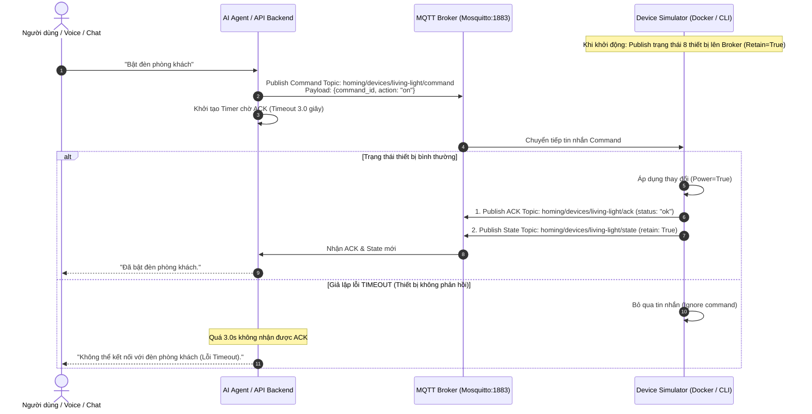

# Hướng dẫn Mô tả và Báo cáo Hệ thống Simulator (Homing Smart Home)

---

## 1. Tóm tắt Báo cáo (30 Giây Pitch)

> **"Device Simulator trong Homing là môi trường giả lập phần cứng IoT chạy độc lập (`src/simulator.py`). Hệ thống giao tiếp với AI Agent và Backend Hub qua MQTT Broker Mosquitto (QoS 1), mô phỏng 8 thiết bị nhà thông minh và hỗ trợ tiêm lỗi (Fault Injection: offline, timeout) để kiểm thử độ tin cậy của agent trong các kịch bản thực tế."**

---

## 2. Mục đích Xây dựng Simulator

1. **Phát triển không phụ thuộc phần cứng thực tế (Hardware-Independence):**
   - Giúp kiểm thử toàn bộ tính năng điều khiển nhà thông minh mà không cần thiết bị IoT phần cứng vật lý.
2. **Kiểm thử khả năng xử lý sự cố của AI Agent (Fault Tolerance Testing):**
   - Giả lập các sự cố mạng và thiết bị (`offline`, `timeout`) để đánh giá phản ứng và thông báo lỗi của AI Agent.
3. **Kiến trúc Giao tiếp Tiêu chuẩn:**
   - Sử dụng giao thức **MQTT** (QoS 1, Mosquitto Broker) đồng bộ với mô hình vận hành của các hệ thống IoT thực tế.

---

## 3. Kiến trúc và Nguyên lý Hoạt động

### 3.1 Sơ đồ luồng giao tiếp (Communication Sequence)

---

## 4. Chi tiết các Thành phần trong Simulator

### 4.1 Danh sách 8 thiết bị IoT được giả lập ([src/simulator.py](src/simulator.py#L14-L23))

| Mã thiết bị (`device_id`) | Tên hiển thị | Loại thiết bị (`kind`) | Trạng thái giả lập (`State Schema`) |
| :--- | :--- | :--- | :--- |
| `living-light` | Đèn phòng khách | `light` | `{"power": false, "brightness": 65}` |
| `bedroom-light` | Đèn phòng ngủ | `light` | `{"power": false, "brightness": 45}` |
| `living-aircon` | Điều hòa phòng khách | `aircon` | `{"power": false, "target_temperature": 25, "mode": "cool"}` |
| `living-blind` | Rèm phòng khách | `blind` | `{"position": 0}` (0: Đóng, 100: Mở) |
| `hub-speaker` | Loa Homing | `speaker` | `{"power": false, "volume": 45, "playing": false}` |
| `entry-lock` | Khóa cửa chính | `lock` | `{"locked": true}` |
| `entry-sensor` | Cảm biến cửa | `sensor` | `{"open": false, "battery": 92}` |
| `living-temperature` | Cảm biến nhiệt độ | `sensor` | `{"temperature": 27.0, "battery": 98}` |

---

### 4.2 Cấu trúc MQTT Topics chuẩn hóa

- **Prefix Topic:** `homing/` (Cấu hình qua biến môi trường `MQTT_TOPIC_PREFIX`).
- **Command Topic (`homing/devices/{id}/command`):** Hub gửi lệnh xuống Simulator.
- **ACK Topic (`homing/devices/{id}/ack`):** Simulator phản hồi kết quả thực thi lệnh (`status: "ok"` hoặc `"error"`).
- **State Topic (`homing/devices/{id}/state`):** Simulator phát trạng thái mới nhất cho toàn hệ thống (`qos=1`, `retain=True`).
- **Fault Topic (`homing/simulator/{id}/fault`):** API kích hoạt lỗi giả lập.

---

### 4.3 Cơ chế tiêm lỗi thực tế (Fault Injection System)

Simulator cho phép kiểm thử phản ứng của hệ thống qua API `/simulator/devices/{id}/fault`:

1. **Chế độ `offline` (Mất mạng):**
   - Simulator phát thông báo `online: false` tới Hub.
   - Hub cập nhật giao diện và AI Agent nhận biết thiết bị đang ngắt kết nối.
2. **Chế độ `timeout` (Thiết bị treo):**
   - Simulator tiếp nhận lệnh nhưng không gửi tin nhắn ACK.
   - Bộ đếm thời gian (3s) ở Backend Hub kích hoạt cảnh báo lỗi timeout.
3. **Chế độ `none` (Hoạt động bình thường):**
   - Khôi phục trạng thái hoạt động chuẩn cho thiết bị.

---

### 4.4 Cơ chế An toàn Khóa cửa (Security Approval Flow)

- Với lệnh an ninh như mở khóa cửa (`unlock`), hệ thống không phát lệnh MQTT ngay.
- Backend tạo yêu cầu **Approval Pending**. Sau khi xác thực mã PIN qua API `/approvals/{id}/approve`, lệnh mới được gửi xuống Simulator.

### 4.5 Phương thức Khởi chạy và Giao diện Trực quan

- **Chạy dòng lệnh (CLI):** Khởi chạy mô phỏng thiết bị qua lệnh `python -m src.simulator` (hoặc `MQTT_BROKER=localhost python -m src.simulator`).
- **Giao diện Web Simulator Tương tác (`frontend-simulator/`):** Hệ thống hỗ trợ giao diện web 2D Canvas (Floor Plan):
  - Bố trí và hiển thị trực quan trạng thái 8 thiết bị IoT theo thời gian thực.
  - Thao tác điều khiển và kiểm thử tiêm lỗi (Fault Injection: `offline`, `timeout`, `none`) trực tiếp trên giao diện web.
  - Theo dõi nhật ký MQTT Console thời gian thực của cả hai chiều In/Out.

---

## 5. Kịch bản Mẫu khi Thuyết trình

> *"Phần mô phỏng phần cứng sử dụng **Device Simulator** (`src/simulator.py`), chạy độc lập qua Docker hoặc lệnh `python -m src.simulator`. Simulator quản lý 8 thiết bị IoT ảo gồm đèn, điều hòa, rèm, loa, khóa cửa và cảm biến.*  
> *Hệ thống giao tiếp qua **Mosquitto MQTT Broker** (QoS 1). Khi nhận lệnh từ backend, Simulator cập nhật trạng thái nội bộ, gửi tin nhắn xác nhận `ack` và phát bản tin `state` (Retain) để Hub đồng bộ giao diện.*  
> *Bộ tiêm lỗi (**Fault Injection**) kết hợp giao diện **frontend-simulator** (2D Canvas Floor Plan và MQTT Console) hỗ trợ giả lập sự cố mất kết nối (`offline`) hoặc không phản hồi (`timeout`) để kiểm thử độ tin cậy của AI Agent."*

---

## 6. Liên kết Mã nguồn Cốt lõi

- Mã nguồn Simulator: [src/simulator.py](src/simulator.py)
- Giao diện Web Simulator: [frontend-simulator/](frontend-simulator/)
- MQTT Client Service (Backend Hub): [src/services/mqtt.py](src/services/mqtt.py)
- Device Registry (Bản sao State): [src/services/devices.py](src/services/devices.py)
- API Simulation Routes: [src/api/routes.py](src/api/routes.py#L87-L99)
- Docker Compose Config: [docker-compose.yml](docker-compose.yml#L31-L44)
