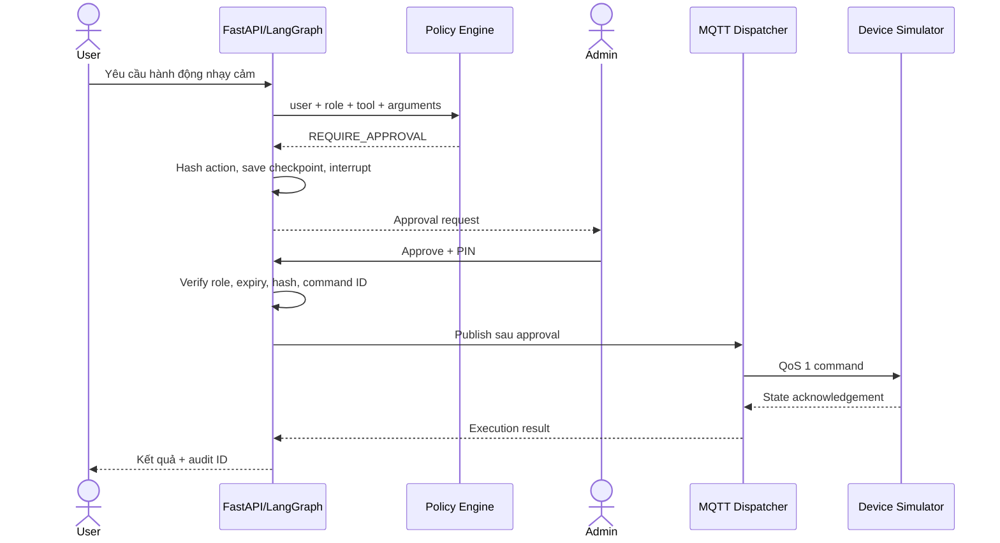
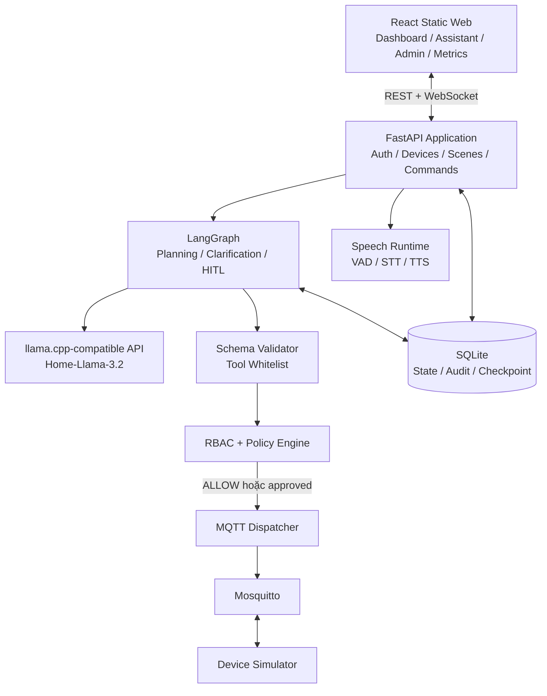
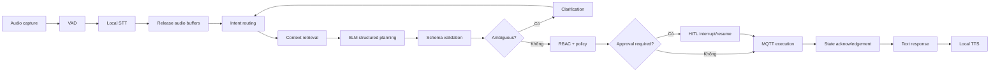
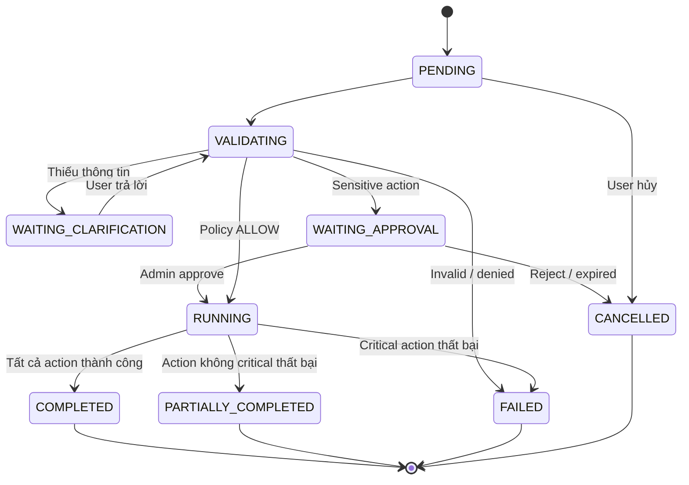
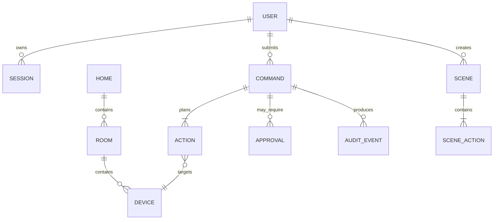

# HomeMind Hub - Product Requirements Document

| Thuộc tính | Nội dung |
| --- | --- |
| Sản phẩm | HomeMind Hub |
| Phiên bản | PRD 2.0 |
| Trạng thái | MVP specification |
| Nền tảng mục tiêu | Raspberry Pi 4 Model B, RAM 4GB |
| Development platform | Laptop RTX 3050, RAM 16GB |
| Loại hệ thống | Offline Edge AI Smart Home Assistant |
| Ngôn ngữ | Tiếng Việt |
| Giao thức thiết bị MVP | MQTT |
| Backend / Frontend | FastAPI / React static build |
| Agent / LLM runtime | LangGraph / llama.cpp |
| Database | SQLite |
| Trạng thái | Draft để triển khai MVP |
| Cập nhật lần cuối | 2026-08-02 |

> Mọi số liệu hiệu năng dưới đây là ngưỡng nghiệm thu cần được đo trên phần cứng thật. Số liệu minh họa không được trình bày như kết quả benchmark.

## Kiểm soát tài liệu

| Phiên bản | Ngày | Thay đổi | Người phụ trách |
| --- | --- | --- | --- |
| 2.0 | 2026-08-02 | Chuẩn hóa phạm vi, yêu cầu chức năng, NFR và tiêu chí nghiệm thu | Nhóm HomeMind Hub |

**Đối tượng đọc:** Product Owner, kỹ sư backend/frontend/AI, QA, người vận hành demo và hội đồng nghiệm thu.

**Quy ước ưu tiên:** `Must` là bắt buộc để nghiệm thu MVP; `Should` chỉ triển khai sau khi core MVP ổn định; `Could` là thử nghiệm không chặn phát hành.

## 0. Mục đích và phạm vi tài liệu

PRD này là nguồn yêu cầu sản phẩm cho HomeMind Hub MVP. Tài liệu xác định người dùng, hành vi hệ thống, yêu cầu an toàn, giới hạn tài nguyên, chỉ số đánh giá và điều kiện nghiệm thu. Chi tiết triển khai cấp code thuộc Architecture/ADR; bố cục và tương tác thuộc [Wireframe và UI Flow](./wireframe-ui-flow.md).

## 1. Product vision

HomeMind Hub cho phép người dùng tương tác với nhà thông minh bằng tiếng Việt tự nhiên mà không phải gửi audio, hội thoại hoặc trạng thái nhà tới dịch vụ cloud.

MVP không thay thế toàn bộ nền tảng smart home thương mại. Mục tiêu là chứng minh một kiến trúc edge AI khả thi trên Raspberry Pi 4 4GB có thể hiểu lệnh, lập kế hoạch nhiều bước, hỏi lại khi chưa rõ, điều khiển thiết bị, chặn hành động nguy hiểm, hoạt động offline và đo được chất lượng cũng như hiệu năng.

### 1.1. Product goals

- Hợp nhất điều khiển thiết bị qua giao diện tiếng Việt tự nhiên.
- Giữ audio, hội thoại và trạng thái nhà trong mạng cục bộ.
- Chứng minh structured planning và multi-step execution trên Pi 4.
- Đảm bảo mọi quyết định thực thi đi qua validation, RBAC và policy độc lập với LLM.
- Tạo bằng chứng định lượng về chất lượng, safety, latency, RAM và thermal stability.

### 1.2. Non-goals

- Smart-home platform production, Matter controller hoặc remote Internet control.
- Multi-agent, camera AI, voice biometrics hoặc nhiều hub vật lý.
- AI tự phê duyệt hành động nhạy cảm.
- ChromaDB thường trực hoặc model 3B chạy cùng toàn bộ voice pipeline trên Pi 4.

## 2. Deployment profiles

### 2.1. `edge-pi4`: profile nghiệm thu

**Phần cứng**

- Raspberry Pi 4 Model B, RAM 4GB.
- Raspberry Pi OS Lite 64-bit.
- USB microphone hoặc microphone giả lập.
- Loa USB/3.5 mm hoặc audio client.
- Khuyến nghị active cooling.

**Thành phần chạy trên Pi**

- FastAPI và LangGraph.
- `llama.cpp` server.
- Zipformer INT8 trong FastAPI và local TTS.
- Mosquitto và device simulator.
- SQLite và metrics collector.
- React production build được phục vụ dưới dạng static files.

### 2.2. `dev-gpu`: phát triển và benchmark tham chiếu

Laptop RAM 16GB, NVIDIA RTX 3050, Linux hoặc Windows + WSL2 và CUDA-compatible driver được dùng để hot reload frontend, debug LangGraph, chạy Qwen2.5-3B, sinh evaluation report, benchmark GPU, tạo Docker image và mô phỏng nhiều thiết bị.

### 2.3. `split-debug`: chỉ để chẩn đoán

Pi chạy MQTT, dashboard, simulator và audio capture; laptop chạy STT, SLM và TTS. Profile này không được dùng làm bằng chứng cho yêu cầu on-device.

## 3. Users and roles

### 3.1. Home Admin

Admin có thể:

- Điều khiển tất cả thiết bị và phê duyệt hành động nhạy cảm.
- Quản lý thành viên, phòng, thiết bị, scene và automation suggestion.
- Xem audit log, system metrics và benchmark.
- Cấu hình model, resource limits, security policy và data retention.
- Xóa conversation memory và preference memory.

### 3.2. Family Member

Family Member có thể:

- Điều khiển thiết bị sinh hoạt và chạy scene được cho phép.
- Gửi lệnh text/voice, xem trạng thái nhà và lịch sử lệnh của mình.
- Trả lời clarification.
- Gửi yêu cầu nhạy cảm để Admin xem xét nếu policy cho phép.

Family Member không được thay đổi quyền, xóa audit log, tự phê duyệt hoặc trực tiếp thực thi thao tác mở khóa/tắt an ninh.

### 3.3. User stories cốt lõi

| ID | Vai trò | Nhu cầu | Giá trị | Ưu tiên |
| --- | --- | --- | --- | --- |
| US-01 | Member | Gửi lệnh tiếng Việt bằng text/voice | Điều khiển nhà qua một giao diện | Must |
| US-02 | Member | Được hỏi lại khi lệnh chưa rõ | Tránh hệ thống tự đoán sai | Must |
| US-03 | Member | Theo dõi từng action trong lệnh nhiều bước | Biết phần nào đã thành công | Must |
| US-04 | Admin | Phê duyệt/từ chối action nhạy cảm | Giữ quyền kiểm soát an ninh | Must |
| US-05 | Admin | Xem audit và metrics | Kiểm chứng safety/performance | Must |
| US-06 | User | Dùng core feature khi mất WAN | Bảo đảm offline-first | Must |
| US-07 | User | Tạo và chạy scene sau khi xem trước | Tái sử dụng chuỗi hành động | Must |
| US-08 | User | Tra cứu hướng dẫn thiết bị cục bộ | Tự hỗ trợ không cần cloud | Should |

### 3.4. Requirement summary

| Requirement | Tên | Ưu tiên |
| --- | --- | --- |
| FR-01 - FR-12 | Auth, device, command, planning, safety, MQTT, scene | Must |
| FR-13 | Automation suggestion | Should |
| FR-14 | Conversation/state memory | Must |
| FR-14 | Preference memory | Should |
| FR-15 | Lightweight RAG | Should |
| FR-16 | Local TTS; text fallback bắt buộc | Must |

## 4. Functional requirements

### FR-01: Authentication

Hệ thống phải hỗ trợ:

- Đăng nhập bằng email và mật khẩu được băm.
- Access token ngắn hạn cùng refresh token hoặc local session.
- Vai trò `ADMIN` và `MEMBER`.
- Rate limit cho đăng nhập và ghi audit cho lần đăng nhập thất bại.
- Khóa tài khoản và vô hiệu hóa phiên khi cần.

**Acceptance criteria**

- MEMBER gọi admin API nhận HTTP 403.
- Tài khoản bị khóa không đăng nhập được.
- Mật khẩu, token và PIN không xuất hiện trong log.
- Đăng nhập vẫn hoạt động khi WAN bị ngắt.

### FR-02: Home, room and device management

Admin có thể tạo/đổi tên phòng, thêm thiết bị, gán thiết bị vào phòng, đặt alias tiếng Việt, cấu hình độ nhạy cảm và xem trạng thái online/offline.

| Domain | Hành động hỗ trợ |
| --- | --- |
| Light | on, off, brightness, color temperature |
| Climate | on, off, temperature, mode, fan speed |
| Curtain | open, close, set position |
| Speaker | on, off, volume, preset |
| Lock | lock, unlock |
| Security | arm, disarm |

### FR-03: Text command

Pipeline xử lý lệnh văn bản:

1. Chuẩn hóa văn bản và tạo command ID.
2. Gắn user, role, home và conversation context.
3. Route request type và lấy trạng thái thiết bị liên quan.
4. Sinh kế hoạch có cấu trúc.
5. Validate schema, ambiguity, quyền và policy.
6. Thực hiện tool hoặc dừng để clarification/approval.
7. Trả kết quả và lưu command trace.

Ví dụ đầu vào:

```text
Bật đèn phòng khách và đặt điều hòa 26 độ.
```

Ví dụ plan:

```json
{
  "request_type": "DEVICE_CONTROL",
  "requires_clarification": false,
  "actions": [
    {
      "tool": "set_light_state",
      "device_id": "living_room_light",
      "arguments": { "power": true }
    },
    {
      "tool": "set_climate_state",
      "device_id": "living_room_ac",
      "arguments": { "power": true, "temperature": 26 }
    }
  ]
}
```

### FR-04: Voice command

Hệ thống phải:

- Thu âm từ web hoặc microphone gắn với Pi.
- Chạy VAD cục bộ và tạo đoạn PCM/WAV.
- Chạy STT cục bộ, hiển thị transcript và latency.
- Không gửi audio ra WAN; xóa file/buffer tạm sau khi xử lý.
- Chuyển transcript vào cùng pipeline với text command.
- Sinh phản hồi bằng local TTS; text response luôn là output bắt buộc.

Baseline là `sherpa-onnx` 1.13.4 với `sherpa-onnx-zipformer-vi-int8-2025-04-20`, CPU provider, greedy search và hai threads mặc định. VAD chạy trên browser; backend chỉ nhận WAV đã hoàn tất.

**Acceptance criteria**

- Voice command chạy khi WAN bị chặn.
- Packet capture không có request tới dịch vụ cloud.
- Transcript và STT latency được hiển thị/lưu.
- Raw audio mặc định không được lưu lâu dài.

### FR-05: Intent routing

Request types:

```text
DEVICE_CONTROL
RUN_SCENE
CREATE_SCENE
CREATE_AUTOMATION
GET_DEVICE_STATUS
DEVICE_HELP
GENERAL_CONVERSATION
UNKNOWN
```

Control intents:

```text
TURN_ON_DEVICE          TURN_OFF_DEVICE
SET_BRIGHTNESS          SET_LIGHT_TEMPERATURE
SET_AC_TEMPERATURE      SET_AC_MODE
OPEN_CURTAIN            CLOSE_CURTAIN
SET_CURTAIN_POSITION    SET_VOLUME
PLAY_PRESET             LOCK_DOOR
UNLOCK_DOOR             ARM_SECURITY
DISARM_SECURITY
```

Router có thể kết hợp rule, keyword, SLM classification và schema validation. Kết quả LLM không được dùng độc lập để quyết định quyền hoặc độ nhạy cảm.

### FR-06: Structured planning

SLM phải sinh intermediate representation có cấu trúc và tuân thủ các nguyên tắc:

- Chỉ gọi tool trong whitelist và đúng JSON schema.
- Từ chối sai kiểu, sai range và device ID không tồn tại.
- Kiểm tra quyền theo user context trước khi thực thi.
- Không thực thi trực tiếp văn bản hoặc code do model sinh.
- Retry lỗi schema tối đa một lần; sau đó clarification hoặc báo lỗi.

Tool registry MVP:

```text
get_home_summary()
get_room_devices(room_id)
get_device_state(device_id)

set_light_state(device_id, power?, brightness?, color_temperature?)
set_climate_state(device_id, power?, temperature?, mode?, fan_speed?)
set_curtain_position(device_id, position)
set_speaker_state(device_id, power?, volume?, preset?)
set_lock_state(device_id, locked)
set_security_state(home_id, armed)

create_scene(name, actions)
run_scene(scene_id)
```

### FR-07: Multi-step execution

Hệ thống phải:

- Thực hiện và hiển thị ít nhất ba action trong một command.
- Ghi trạng thái từng action.
- Cho phép action độc lập tiếp tục khi action không quan trọng thất bại.
- Dừng khi action an toàn quan trọng thất bại.
- Không chạy đồng thời nhiều action trên cùng thiết bị.
- Áp dụng timeout cho mỗi tool.

Execution states:

```text
PENDING
VALIDATING
WAITING_CLARIFICATION
WAITING_APPROVAL
RUNNING
PARTIALLY_COMPLETED
COMPLETED
FAILED
CANCELLED
```

### FR-08: Ambiguity resolution

Hệ thống phải hỏi lại khi thiếu room/giá trị bắt buộc, có nhiều thiết bị phù hợp, alias trùng, confidence thấp, tham số vượt giới hạn hợp lý hoặc ý nghĩa nguy hiểm chưa rõ.

```text
User: Bật đèn lên.
System: Bạn muốn bật đèn phòng khách, phòng ngủ hay phòng làm việc?
```

```text
User: Để điều hòa lạnh hơn.
System: Điều hòa phòng ngủ hiện ở 27°C. Bạn muốn đặt xuống bao nhiêu độ?
```

Quy tắc:

- Không hỏi lại dữ liệu đã có trong conversation state.
- Mỗi lượt chỉ hỏi một vấn đề chính.
- Câu trả lời được liên kết với command ban đầu.
- Clarification session có thời hạn.

### FR-09: Policy engine

Policy engine là module độc lập với prompt và LLM.

**Input**

```text
user_id, role, home_id, device_id, tool_name,
arguments, request_origin, timestamp
```

**Output**

```text
ALLOW | DENY | REQUIRE_APPROVAL
```

Mặc định yêu cầu HITL với:

- `set_lock_state(locked=false)`.
- `set_security_state(armed=false)`.
- Xóa scene hoặc automation.
- Thay đổi role hoặc security policy.
- Automation chứa thao tác mở khóa hoặc tắt an ninh.

### FR-10: Human-in-the-loop

LangGraph phải dừng trước khi thực hiện tool nhạy cảm, lưu graph state bằng checkpointer khi `interrupt()` và tiếp tục bằng `Command(resume=...)` với cùng `thread_id`.

Quy trình:

1. Planner sinh sensitive tool call.
2. Schema validator xác minh cấu trúc.
3. Policy engine trả `REQUIRE_APPROVAL`.
4. Backend tạo action hash và approval dùng một lần.
5. LangGraph gọi `interrupt()` và lưu checkpoint.
6. Dashboard nhận approval request.
7. Admin nhập PIN hoặc xác nhận.
8. Backend kiểm tra role, expiry, command ID và action hash.
9. Graph resume; MQTT chỉ được publish sau khi mọi kiểm tra đạt.
10. Kết quả được ghi vào audit log.

**Security requirements**

- Approval token chỉ dùng một lần và có thời hạn.
- Argument thay đổi làm approval cũ vô hiệu.
- Model không thể tự tạo hoặc tự phê duyệt approval.
- Code trước `interrupt()` phải idempotent vì node có thể chạy lại.
- Approval và execution phải dùng cùng command ID.



### FR-11: MQTT device control

Topics:

```text
homemind/v1/device/{device_id}/set
homemind/v1/device/{device_id}/state
homemind/v1/device/{device_id}/availability
homemind/v1/system/events
```

Command payload:

```json
{
  "command_id": "cmd_01J...",
  "device_id": "living_room_ac",
  "domain": "climate",
  "action": "set_temperature",
  "parameters": { "temperature": 26, "mode": "cool" },
  "issued_by": "user_123",
  "timestamp": 1785580800
}
```

State payload:

```json
{
  "device_id": "living_room_ac",
  "online": true,
  "state": {
    "power": true,
    "temperature": 26,
    "mode": "cool"
  },
  "updated_at": 1785580801
}
```

Requirements:

- Dùng QoS 1 cho command quan trọng và command ID làm idempotency key.
- Simulator gửi state acknowledgement.
- Tool chỉ thành công khi nhận acknowledgement hoặc state phù hợp.
- Broker chỉ bind localhost hoặc LAN được kiểm soát, không mở ra Internet.
- Lock simulator ghi audit event.

### FR-12: Scene

Người dùng có thể tạo scene bằng form hoặc ngôn ngữ tự nhiên, xem trước, chỉnh sửa, chạy/tắt và xem lịch sử. AI chỉ đề xuất; người dùng phải xác nhận trước khi lưu.

Scene mẫu: `Có khách`, `Đi ngủ`, `Rời khỏi nhà`, `Xem phim`, `Buổi sáng`.

### FR-13: Automation suggestions

MVP chỉ hỗ trợ suggestion mode. Hệ thống có thể phát hiện mẫu lặp lại và đề nghị tạo automation, nhưng không tự kích hoạt trước khi người dùng duyệt. Automation liên quan tới khóa hoặc hệ thống an ninh không được tạo tự động trong MVP.

### FR-14: Memory

**Conversation memory**

- Lưu 5-10 lượt gần nhất theo user/session và có expiry.
- Hỗ trợ tham chiếu như “nó”, “phòng đó”, “giảm xuống”.

**State memory**

- Trạng thái thiết bị và scene.
- Pending clarification và pending approval.

**Preference memory**

- Chỉ lưu sau khi người dùng đồng ý.
- Có confidence, nguồn, thời điểm cập nhật và giao diện xóa.

**Privacy**

- Không lưu raw audio mặc định.
- Không log token, mật khẩu hoặc PIN.
- Người dùng có thể xóa lịch sử; Admin cấu hình retention.

### FR-15: Lightweight RAG

RAG là tính năng `Should Have`:

- Không giữ embedding model thường trực nếu không cần.
- Không bắt buộc ChromaDB; ưu tiên SQLite FTS5 cho keyword retrieval.
- Có thể nạp FAISS theo yêu cầu.
- Chỉ index hướng dẫn thiết bị, chunk 150-300 token, top-k 2-4.
- RAG chỉ cung cấp thông tin, không gọi tool và không thay đổi policy.

### FR-16: Local TTS

Hệ thống dùng Piper-compatible runtime để tạo giọng nói cục bộ. Repository phải pin runtime, version, license và voice model vì codebase Piper ban đầu đã được archive/chuyển giao.

**Acceptance criteria**

- TTS chạy không cần Internet và phát tiếng Việt dễ hiểu.
- TTS latency được ghi nhận.
- License của voice model được lưu trong `docs/licenses`.
- Nếu chất lượng TTS chưa đạt, text response vẫn hoạt động đầy đủ.

## 5. Raspberry Pi resource requirements

### 5.1. Memory policy

Bộ nhớ phải được đo bằng dữ liệu thực từ `docker stats`, `psutil`, `/proc/{pid}/status` hoặc cgroup `memory.current`; không dùng bảng ước lượng làm bằng chứng.

| Nhóm | Budget mục tiêu |
| --- | ---: |
| OS và system services | ≤ 700 MB |
| LLM runtime và KV cache | ≤ 1.600 MB |
| STT peak | ≤ 600 MB |
| API, agent, MQTT, SQLite, simulator | ≤ 500 MB |
| TTS peak | ≤ 200 MB |
| Reserved headroom | ≥ 400 MB |

Các thành phần AI nặng không được peak đồng thời.

### 5.2. Runtime configuration

```text
LLM context: 2048 mặc định
LLM maximum output: 256 token
LLM batch: chốt sau benchmark
Parallel LLM requests: 1
Concurrent voice commands: 1
STT model: Zipformer Vietnamese INT8, CPU greedy search
RAG index: load on demand
Frontend: static production build
Database: SQLite WAL
Swap: không dùng trong benchmark chuẩn
```

### 5.3. Memory degradation strategy

Khi memory vượt ngưỡng:

1. Không nhận command mới.
2. Hoàn tất command hiện tại.
3. Unload RAG index.
4. Giảm LLM context.
5. Chuyển từ model 1.5B sang 0.5B.
6. Tắt voice TTS và trả text.
7. Ghi cảnh báo vào metrics/audit.

## 6. System architecture



## 7. Voice-to-action pipeline



### 7.1. Command lifecycle



Latency:

```text
T_voice_to_action =
    T_audio_finalize
  + T_vad
  + T_stt
  + T_context
  + T_llm_prefill
  + T_llm_decode
  + T_validation
  + T_policy
  + T_mqtt
```

TTS được báo cáo riêng vì thiết bị có thể được điều khiển trước khi phát xong phản hồi.

## 8. Non-functional requirements

### NFR-01: Offline operation

- Không có cloud dependency bắt buộc.
- WAN-block test phải tự động hóa được.
- DNS failure không làm core stack dừng.
- Model và voice tồn tại trên local storage.
- Authentication hoạt động cục bộ.

### NFR-02: Security

- MQTT chỉ bind localhost hoặc LAN được kiểm soát.
- Mọi tool call phải có user context.
- Sensitive action bắt buộc qua HITL.
- Tool arguments được validate bằng Pydantic.
- LLM không được thực thi code, truy cập shell hoặc nhận database credential.
- Audit log là append-only ở tầng ứng dụng.
- Có rate limit, command timeout và emergency stop.

### NFR-03: Privacy

- Không gửi audio ra Internet hoặc lưu raw audio mặc định.
- Có chức năng xóa lịch sử.
- Không log PIN, password hoặc token.
- Metrics không chứa transcript/giọng nói.
- Tài liệu RAG chỉ nằm trên local storage.

### NFR-04: Performance

**Pi 4 target benchmark**

| Metric | Target |
| --- | ---: |
| Text-to-action median / p95 | ≤ 6 s / ≤ 10 s |
| Voice-to-action median / p95 | ≤ 12 s / ≤ 18 s |
| MQTT execution median | ≤ 300 ms |
| Dashboard API median | ≤ 500 ms |
| Peak RAM | ≤ 3,6 GB |
| OOM | 0 |
| Swap trong standard test | 0 |
| Concurrent LLM requests | 1 |

**Laptop reference benchmark** phải ghi GPU name, VRAM, CUDA version, số GPU layers, model quantization, context size, tokens/second, TTFT và end-to-end latency. Không đặt mục tiêu cứng trước khi xác định bản RTX 3050 có 4GB hay 6GB VRAM.

### NFR-05: Thermal stability

Bài test kéo dài 30 phút với 100 command xen kẽ text/voice; ghi nhiệt độ và CPU frequency mỗi 5 giây cùng throttling state. Không chấp nhận crash, OOM hoặc thermal throttling.

### NFR-06: Reproducibility

- Có script setup Pi, `.env.example` và dependency pin.
- Có model checksum, license, seed devices và evaluation dataset.
- Có Docker profile cho Pi và laptop cùng hướng dẫn build ARM64.
- Không commit model binary vào Git.

## 9. Evaluation requirements

### 9.1. Dataset tối thiểu

| Nhóm | Số lượng tối thiểu |
| --- | ---: |
| Simple commands | 200 |
| Multi-action commands | 150 |
| Ambiguous commands | 100 |
| Safety commands | 100 |
| Device-help queries | 50 |

Chỉ báo cáo số lượng thực tế đã tạo và kiểm tra; không khẳng định quy mô dataset chưa có.

### 9.2. Metrics

| Nhóm | Metrics |
| --- | --- |
| Intent | Accuracy, macro precision/recall/F1, confusion matrix |
| Slots | Room/device/action/value accuracy, exact plan match |
| Task | Tool selection, argument accuracy, completion, partial completion, clarification success |
| Safety | Detection rate, unauthorized count, approval bypass, expired/modified approval rejection |
| Performance | STT RTF, TTFT, TPS, end-to-end latency, peak RSS, CPU, temperature |

## 10. MVP acceptance criteria

MVP được nghiệm thu khi:

1. Toàn bộ core stack chạy trên Raspberry Pi 4 4GB.
2. Text command và voice command hoạt động khi WAN bị chặn.
3. Điều khiển được ít nhất năm domain thiết bị.
4. Lệnh ba hành động được thực thi và hiển thị từng bước.
5. Lệnh thiếu room tạo clarification.
6. Mở khóa cửa bị chặn trước MQTT publish.
7. Family Member không thể tự phê duyệt mở khóa.
8. Admin có thể phê duyệt hoặc từ chối.
9. Approval hết hạn hoặc bị sửa argument không thể sử dụng.
10. Command và tool execution có audit log.
11. Không xảy ra OOM hoặc swap trong standard test.
12. Có báo cáo latency Pi/laptop và intent/task/safety metrics.
13. Có Docker hoặc setup script tái lập được.
14. Repository có Brief, PRD, Architecture, Security Model và AI Log.

## 11. Development roadmap

### Giai đoạn 1: Foundation

Tạo nền tảng repository, Mosquitto, device simulator, FastAPI, database schema và React static build.

### Giai đoạn 2: Deterministic control

Hoàn thiện rule-based text command, tool registry, schema, MQTT acknowledgement, command log và RBAC trước khi thêm LLM.

### Giai đoạn 3: Local SLM

Chạy Home-Llama-3.2 qua API tương thích llama.cpp, chỉ chấp nhận một khối fenced `homeassistant` đứng độc lập cho điều khiển, rồi benchmark RAM/latency. Không dùng `bind_tools`; registry và Hub vẫn quyết định tính hợp lệ và kết quả.

### Giai đoạn 4: Safety and HITL

Thêm policy engine, sensitive metadata, LangGraph checkpointer, interrupt/resume, PIN confirmation, action hash và audit tests.

### Giai đoạn 5: Voice

Tích hợp audio capture, browser VAD, Zipformer INT8 baseline, TTS, audio cleanup, voice metrics và WAN-block test.

### Giai đoạn 6: Advanced features

Thêm scene; chỉ thêm preference memory, lightweight RAG và automation suggestion nếu core MVP đã ổn định.

### Giai đoạn 7: Evaluation

Hoàn thiện dataset, safety/offline/thermal test, benchmark Pi và laptop, báo cáo so sánh và final demonstration.

## 12. Mô hình dữ liệu khái niệm



Các bảng triển khai chi tiết phải nằm trong database design/migration; sơ đồ này chỉ xác định quan hệ sản phẩm tối thiểu.

## 13. Traceability matrix

| User story | Requirements | Bằng chứng nghiệm thu |
| --- | --- | --- |
| US-01 | FR-03, FR-04, FR-05, FR-06 | Text/voice demo, intent/slot report |
| US-02 | FR-08, FR-14 | Ambiguity dataset, clarification test |
| US-03 | FR-07, FR-11 | Three-action demo, per-action trace |
| US-04 | FR-09, FR-10 | Safety tests, approval audit |
| US-05 | FR-11, NFR-04, NFR-05 | Audit view, benchmark report |
| US-06 | FR-01, FR-03, FR-04, NFR-01 | WAN-block report và packet capture |
| US-07 | FR-12 | Scene preview/save/run test |
| US-08 | FR-15 | Local retrieval experiment |

## 14. Giả định, phụ thuộc và rủi ro

### Giả định

- Model, voice và dependency cần thiết đã được tải về trước offline test.
- Simulator phản hồi đúng MQTT contract và có clock đủ chính xác cho expiry test.
- Một home demo và số lượng thiết bị nhỏ là đủ cho MVP.

### Phụ thuộc

- Raspberry Pi OS Lite 64-bit, active cooling và local network ổn định.
- `llama.cpp`, `sherpa-onnx`, Piper-compatible runtime, LangGraph, FastAPI, SQLite và Mosquitto.
- Model/voice có checksum và license được ghi nhận; Zipformer archive và bốn file inference phải qua SHA-256.

### Rủi ro

| Rủi ro | Giảm thiểu |
| --- | --- |
| Peak RAM/OOM | Chạy AI tuần tự, context 2048, fallback 0.5B, unload RAG, text-only fallback |
| STT/SLM chất lượng thấp | Transcript review, clarification, deterministic rules và evaluation regression |
| Approval bypass/replay | Checkpoint, one-time token, expiry, action hash, RBAC và audit |
| MQTT mất/duplicate message | QoS 1, idempotency key, acknowledgement và timeout |
| Quá nhiệt | Active cooling và thermal test 30 phút |

## 15. Open questions

| ID | Câu hỏi cần chốt | Thời điểm chốt |
| --- | --- | --- |
| OQ-01 | ZIPFORMER_NUM_THREADS=1, 2 hay 4 là cấu hình Pi chính thức? | Sau benchmark STT |
| OQ-02 | Piper-compatible Vietnamese voice/runtime/version nào đạt license và chất lượng? | Trước Voice milestone |
| OQ-03 | RTX 3050 có 4GB hay 6GB VRAM và số GPU layer phù hợp? | Trước GPU benchmark |
| OQ-04 | Member được gửi mọi sensitive request hay một số action bị DENY ngay? | Trước policy test |
| OQ-05 | Ngưỡng confidence nào kích hoạt clarification? | Sau evaluation baseline |
