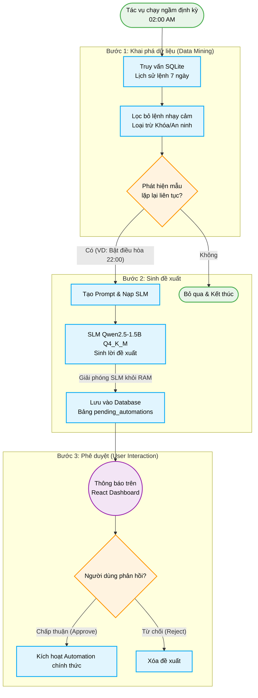

# Proactive Automation Flow: Gợi ý Kịch bản Tự động hóa Chủ động

## 1. Tổng quan Quy trình

Hệ thống sử dụng tác vụ chạy ngầm định kỳ để nhận diện thói quen sử dụng thiết bị (pattern matching) từ nhật ký hoạt động. Sau khi kiểm tra quy tắc an toàn, mô hình SLM (`Qwen2.5-1.5B` lượng tử hóa Q4_K_M) sinh nội dung đề xuất và chuyển lên React Dashboard để người dùng phê duyệt.

---

## 2. Sơ đồ Luồng Gợi ý Automation

---

## 3. Chi tiết từng Bước Thực hiện

### Bước 1: Khai phá Dữ liệu (Data Mining & Pattern Detection)
- **Tác vụ chạy ngầm định kỳ**: Lập lịch tự động kích hoạt vào khung giờ thấp điểm (02:00 AM).
- **Truy vấn Lịch sử**: Đọc lịch sử câu lệnh và nhật ký điều khiển thiết bị trong 7 ngày gần nhất từ database SQLite cục bộ.
- **Lọc lệnh an ninh**: Loại trừ các thiết bị và hành động nhạy cảm (như mở khóa cửa `entry-lock`, đổi mã PIN).
- **Phát hiện chuỗi hành vi**: Phân tích tần suất và khung giờ lặp lại (ví dụ: bật điều hòa phòng khách lúc 22:00 trong 5 trên 7 ngày gần nhất). Nếu không phát hiện chu kỳ đạt ngưỡng tin cậy, tác vụ kết thúc.

### Bước 2: Sinh Đề xuất (Recommendation Generation)
- **Tạo Prompt & Nạp SLM**: Khi phát hiện mẫu hành vi hợp lệ, hệ thống tạo context prompt và nạp mô hình `Qwen2.5-1.5B` (Q4_K_M qua `llama.cpp`) vào RAM.
- **Sinh văn bản đề xuất**: Mô hình tạo câu gợi ý trực tiếp (ví dụ: *"Hệ thống nhận thấy bạn thường bật điều hòa lúc 22:00. Bạn có muốn tạo lịch tự động hàng ngày không?"*).
- **Giải phóng SLM & Lưu Database**: Giải phóng mô hình khỏi RAM ngay sau khi tạo văn bản xong. Đề xuất được lưu vào bảng `pending_automations` trong SQLite.

### Bước 3: Phê duyệt và Tương tác Người dùng (User Approval)
- **Thông báo**: Hiển thị badge thông báo đề xuất trên thanh điều hướng của React Dashboard (`frontend/`).
- **Xử lý phản hồi**:
  - **Chấp thuận (Approve)**: Chuyển kịch bản gợi ý thành kịch bản tự động hóa chính thức và kích hoạt lịch trình điều khiển qua MQTT.
  - **Từ chối (Reject)**: Đánh dấu từ chối hoặc xóa bản ghi khỏi bảng `pending_automations`.

---

## 4. Quy tắc An toàn và Tối ưu Tài nguyên

1. **Khung giờ thấp điểm**: Tác vụ khai phá dữ liệu chạy vào 02:00 AM để tránh ảnh hưởng tài nguyên trong khung giờ người dùng thao tác.
2. **Bảo vệ an ninh**: Không tự động hóa hoặc đề xuất tự động hóa đối với khóa cửa, còi báo động hay mã PIN.
3. **Vòng đời bộ nhớ SLM**: Nạp mô hình khi sinh văn bản đề xuất và giải phóng khỏi RAM ngay sau khi lưu dữ liệu.
4. **Cơ chế User-in-the-Loop**: Kịch bản tự động hóa chỉ kích hoạt khi người dùng nhấn nút chấp thuận trên giao diện.
