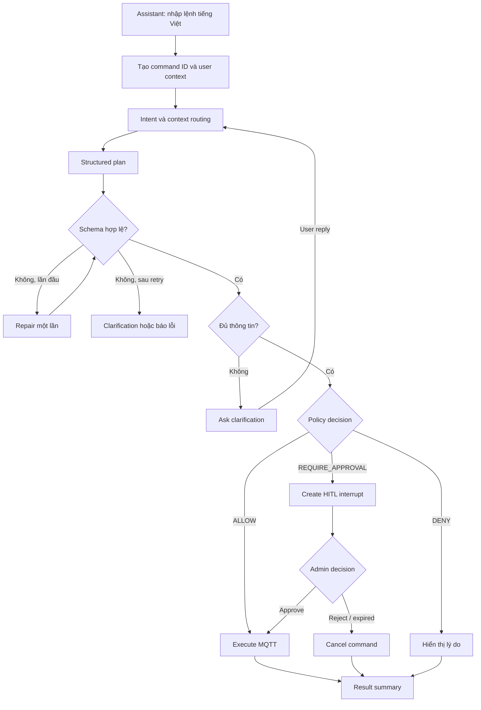
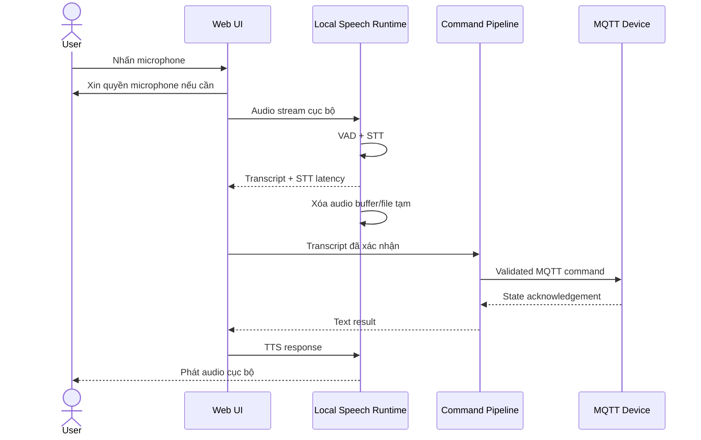
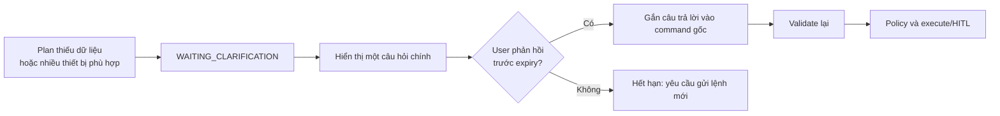
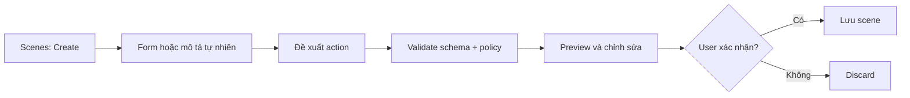
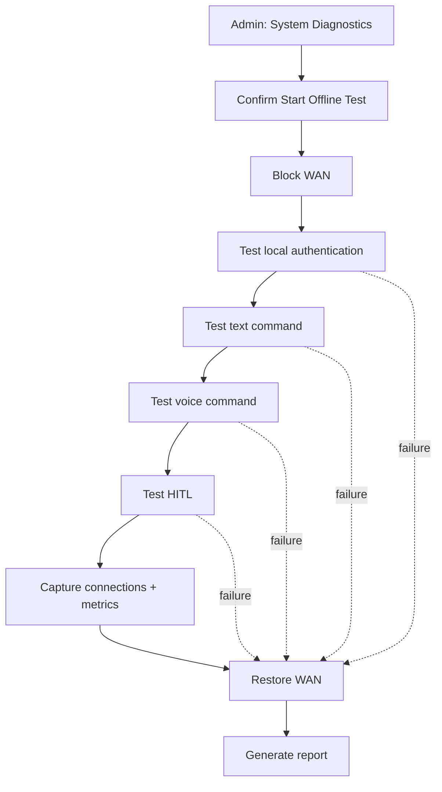

# HomeMind Hub - Wireframe và UI Flow

| Thuộc tính | Nội dung |
| --- | --- |
| Sản phẩm | HomeMind Hub |
| Phiên bản | UI specification 1.0 |
| Giao diện | React production build |
| Thiết bị chính | Desktop/tablet trong mạng gia đình |
| Ngôn ngữ | Tiếng Việt |
| Trạng thái | Draft UX specification |
| Cập nhật lần cuối | 2026-08-02 |

> Số liệu model, latency, RAM và nhiệt độ trong wireframe chỉ là dữ liệu minh họa. Giao diện production phải hiển thị dữ liệu đo thực tế.

## Kiểm soát tài liệu

| Phiên bản | Ngày | Thay đổi | Người phụ trách |
| --- | --- | --- | --- |
| 1.0 | 2026-08-02 | Chuẩn hóa information architecture, UI flows và low-fidelity wireframes | Nhóm HomeMind Hub |

**Mức độ thiết kế:** low-fidelity. Tài liệu xác định cấu trúc, hành vi và trạng thái; visual style chi tiết và prototype tương tác chưa thuộc phạm vi.

**Tài liệu nguồn:** [Project Brief](./brief.md) và [Product Requirements Document](./prd.md).

## 1. Mục tiêu trải nghiệm

- Cho người dùng biết hệ thống đang chạy local/offline.
- Hiển thị rõ transcript, kế hoạch và trạng thái từng action.
- Hỏi lại một vấn đề chính khi yêu cầu chưa đủ thông tin.
- Cho thấy hành động nhạy cảm chưa được gửi tới thiết bị khi đang chờ duyệt.
- Phân biệt rõ quyền của Admin và Family Member.
- Luôn có text response, kể cả khi voice/TTS không khả dụng.

### 1.1. Ngữ cảnh sử dụng

- **Admin:** quản lý và giám sát trên desktop/tablet, xử lý approval khẩn trong mạng gia đình.
- **Family Member:** gửi lệnh nhanh bằng text/voice và xem trạng thái trên desktop, tablet hoặc mobile browser.
- **Điều kiện lỗi:** WAN mất, thiết bị offline, STT/TTS lỗi hoặc Pi gần ngưỡng tài nguyên; UI vẫn phải nói rõ trạng thái và đường phục hồi.

### 1.2. Nguyên tắc thiết kế

- **Local is visible:** luôn hiển thị active profile và trạng thái local/offline.
- **Plan before action:** người dùng thấy action dự kiến và tiến độ thực thi.
- **Safety is explicit:** approval hiển thị action, requester, device, expiry và trạng thái chưa publish.
- **Recoverable by default:** cho phép hủy, ghi âm lại, sửa transcript hoặc gửi lại lệnh hết hạn.
- **Text remains primary fallback:** voice là kênh nhập/xuất bổ sung, không phải điểm lỗi duy nhất.

## 2. Information architecture

```mermaid
flowchart TB
    Root[HomeMind Hub]
    Root --> Login[Login]
    Root --> Dashboard[Dashboard]
    Root --> Assistant[Assistant]
    Root --> Rooms[Rooms]
    Root --> Scenes[Scenes]
    Root --> Approvals[Approvals]
    Root --> Activity[Activity]
    Root --> Performance[AI Performance]
    Root --> Admin[Admin]

    Dashboard --> Overview[Home overview]
    Dashboard --> RoomStatus[Room status]
    Dashboard --> Pending[Pending approvals]
    Dashboard --> Recent[Recent commands]
    Dashboard --> PiStatus[Pi resources]

    Assistant --> TextInput[Text input]
    Assistant --> VoiceInput[Voice input / transcript]
    Assistant --> Plan[Execution plan]
    Assistant --> Clarification[Clarification]
    Assistant --> Result[Result]

    Rooms --> RoomList[Room list]
    Rooms --> RoomDetail[Room detail / device control]
    Scenes --> SceneList[Scene list]
    Scenes --> SceneEditor[Preview / editor / history]
    Approvals --> ApprovalStates[Pending / approved / rejected / expired]
    Activity --> Logs[Commands / tools / MQTT / audit]
    Performance --> Metrics[Model / STT / LLM / resources / benchmark]
    Admin --> Settings[Users / devices / policy / model / retention / diagnostics]
```



### 2.1. Screen inventory

| ID | Màn hình | Người dùng | Mục tiêu chính | Requirement |
| --- | --- | --- | --- | --- |
| UI-01 | Login | Admin, Member | Xác thực cục bộ | FR-01 |
| UI-02 | Dashboard | Admin, Member | Tổng quan nhà, command và tài nguyên | FR-02, FR-07 |
| UI-03 | Assistant | Admin, Member | Text/voice command và execution plan | FR-03 - FR-08 |
| UI-04 | Rooms | Admin, Member | Xem/điều khiển thiết bị | FR-02, FR-11 |
| UI-05 | Scenes | Admin, Member | Preview, edit và run scene | FR-12 |
| UI-06 | Approvals | Admin; Member read-only | Duyệt/từ chối sensitive action | FR-09, FR-10 |
| UI-07 | Activity | Theo quyền | Xem command/tool/MQTT/audit | FR-07, FR-11 |
| UI-08 | AI Performance | Admin | Xem benchmark và resource metrics | NFR-04, NFR-05 |
| UI-09 | Admin | Admin | Users, devices, policy, model, retention | FR-01, FR-02, FR-09, FR-14 |

### 2.2. Điều hướng theo vai trò

| Khu vực | Admin | Family Member |
| --- | :---: | :---: |
| Dashboard, Assistant, Rooms | Có | Có |
| Scenes được cấp quyền | Có | Có |
| Approval queue | Duyệt/từ chối | Chỉ xem request của mình |
| Activity | Toàn bộ | Lệnh của mình |
| AI Performance | Có | Không mặc định |
| Admin settings | Có | Không |

## 3. UI flows

### 3.1. Text command



### 3.2. Voice command



Nếu microphone, STT hoặc TTS lỗi, giao diện giữ nguyên text input/text response và hiển thị thông báo phục hồi ngắn gọn.

### 3.3. Clarification



Session hết hạn phải yêu cầu người dùng gửi lại lệnh, không tái sử dụng context cũ.

### 3.4. Sensitive action / HITL

```mermaid
sequenceDiagram
    actor Member as Family Member
    participant Core as Planner / Policy
    actor Admin
    participant MQTT as MQTT Dispatcher

    Member->>Core: “Mở khóa cửa chính”
    Core->>Core: Validate schema + RBAC
    Core->>Core: REQUIRE_APPROVAL<br/>checkpoint + hash + expiry
    Core-->>Admin: Approval modal
    alt Admin approves before expiry
        Admin->>Core: PIN + confirmation
        Core->>Core: Verify role, hash, expiry, command ID
        Core->>MQTT: Publish unlock command
        MQTT-->>Core: Acknowledgement
        Core-->>Member: Completed + audit ID
    else Reject, expired, or invalid
        Admin-->>Core: Reject hoặc không phản hồi
        Core-->>Member: Cancelled; không MQTT publish
    end
```

Giao diện phải nói rõ “Hành động chưa được gửi tới thiết bị” trong thời gian chờ duyệt. Family Member không thấy ô nhập PIN và không thể gọi approve action.

### 3.5. Scene creation



AI không tự lưu scene. Scene chứa hành động nhạy cảm phải hiển thị cảnh báo và vẫn qua HITL mỗi lần chạy theo policy.

### 3.6. Offline verification



Giao diện phải cảnh báo trước khi bắt đầu và luôn có bước khôi phục WAN, kể cả khi test thất bại.

## 4. Wireframes

### 4.1. Login

```text
┌────────────────────────────────────────────────────┐
│ HomeMind Hub                         LOCAL / OFFLINE│
├────────────────────────────────────────────────────┤
│                                                    │
│                  Đăng nhập                         │
│                                                    │
│ Email                                              │
│ ┌────────────────────────────────────────────────┐ │
│ │                                                │ │
│ └────────────────────────────────────────────────┘ │
│ Mật khẩu                                           │
│ ┌────────────────────────────────────────────────┐ │
│ │ ••••••••                                       │ │
│ └────────────────────────────────────────────────┘ │
│                                                    │
│                         [Đăng nhập]                │
│                                                    │
│ Xác thực được xử lý trong mạng gia đình.           │
└────────────────────────────────────────────────────┘
```

### 4.2. Dashboard

```text
┌──────────────────────────────────────────────────────────────────────┐
│ HomeMind Hub   Dashboard  Assistant  Rooms  Scenes  Activity  Admin │
├──────────────────────────────────────────────────────────────────────┤
│ Home: Căn hộ Demo                         Mode: ● OFFLINE / LOCAL AI │
│                                                                      │
│ ┌────────────┐ ┌────────────┐ ┌────────────┐ ┌────────────────────┐ │
│ │ 12 Devices │ │ 10 Online  │ │ 2 Offline  │ │ 1 Pending Approval │ │
│ └────────────┘ └────────────┘ └────────────┘ └────────────────────┘ │
│                                                                      │
│ Raspberry Pi 4                                                      │
│ ┌──────────────────────────────────────────────────────────────────┐ │
│ │ CPU 72%  RAM 2.8/3.8GB  Temp 61°C  Swap 0MB  Model: 1.5B Q4    │ │
│ └──────────────────────────────────────────────────────────────────┘ │
│                                                                      │
│ Rooms                                                               │
│ ┌───────────────────────────┐  ┌──────────────────────────────────┐ │
│ │ Phòng khách               │  │ Phòng ngủ                       │ │
│ │ Light: ON 70%             │  │ Light: OFF                      │ │
│ │ AC: 26°C                  │  │ AC: 27°C                        │ │
│ │ Curtain: 50%              │  │ Curtain: CLOSED                 │ │
│ └───────────────────────────┘  └──────────────────────────────────┘ │
│                                                                      │
│ Recent commands                                                     │
│ 17:10 Bật đèn phòng khách                  COMPLETED       4.2s     │
│ 17:08 Mở khóa cửa chính                    WAITING APPROVAL          │
│                                                                      │
│ ┌──────────────────────────────────────────────────────────────────┐ │
│ │ Nhập yêu cầu tiếng Việt...                              [Mic][Gửi]│ │
│ └──────────────────────────────────────────────────────────────────┘ │
└──────────────────────────────────────────────────────────────────────┘
```

### 4.3. Assistant execution view

```text
┌──────────────────────────────────────────────────────────────────────┐
│ AI Assistant                       Model: Qwen2.5-1.5B Q4 · Local    │
├──────────────────────────────────────────────────────────────────────┤
│ User                                                                 │
│ Tối nay có khách, bật đèn phòng khách màu ấm, mở nhạc nhẹ và đặt    │
│ điều hòa 26 độ.                                                       │
│                                                                      │
│ Parsed request                                                       │
│ Room: Phòng khách                                                    │
│ Actions: 4                                                           │
│                                                                      │
│ Execution plan                                                       │
│ ✓ 1. Bật đèn phòng khách                                             │
│ ✓ 2. Đặt nhiệt độ màu 3200K                                          │
│ ◌ 3. Bật preset nhạc nhẹ                                             │
│ ◌ 4. Đặt điều hòa 26°C                                               │
│                                                                      │
│ [Dừng thực hiện] [Xem JSON plan]                                     │
│                                                                      │
│ Metrics                                                              │
│ STT: N/A | Context: 0.1s | LLM: 3.7s | MQTT: 0.2s | Total: 4.1s       │
└──────────────────────────────────────────────────────────────────────┘
```

Action status dùng cả biểu tượng và chữ (`Đang chờ`, `Đang chạy`, `Hoàn tất`, `Lỗi`), không chỉ dựa vào màu.

### 4.4. Voice capture

```text
┌────────────────────────────────────────────────────┐
│ Voice Command                                      │
├────────────────────────────────────────────────────┤
│                                                    │
│              ▂▃▆█▇▅▃▂▅▇█▆▃                       │
│                                                    │
│                  Đang nghe...                      │
│                                                    │
│ [Dừng ghi âm]                                      │
│                                                    │
│ Audio được xử lý cục bộ trên Raspberry Pi.         │
│ Audio sẽ bị xóa sau khi nhận dạng.                 │
└────────────────────────────────────────────────────┘
```

### 4.5. Transcript review

```text
┌────────────────────────────────────────────────────┐
│ Transcript                                         │
├────────────────────────────────────────────────────┤
│ “Bật đèn phòng khách và đặt điều hòa hai mươi sáu  │
│ độ.”                                               │
│                                                    │
│ STT model: Whisper multilingual tiny Q5            │
│ STT latency: 3.4s                                  │
│                                                    │
│ [Ghi âm lại]                  [Thực hiện lệnh]      │
└────────────────────────────────────────────────────┘
```

Transcript phải cho phép sửa trước khi thực hiện nếu profile bật bước review.

### 4.6. Clarification

```text
┌────────────────────────────────────────────────────┐
│ Cần thêm thông tin                                 │
├────────────────────────────────────────────────────┤
│ Bạn muốn bật điều hòa ở phòng nào?                 │
│                                                    │
│ ○ Phòng khách                                      │
│ ○ Phòng ngủ                                        │
│ ○ Phòng làm việc                                   │
│                                                    │
│ [Hủy lệnh]                         [Tiếp tục]       │
└────────────────────────────────────────────────────┘
```

### 4.7. HITL approval

```text
┌───────────────────────────────────────────────────────┐
│ CẢNH BÁO: Hành động an ninh cần xác nhận             │
├───────────────────────────────────────────────────────┤
│ Action: Mở khóa cửa chính                            │
│ Requested by: Family Member                           │
│ Device: main_door_lock                                │
│ Current state: LOCKED                                 │
│ Request expires in: 01:42                             │
│                                                       │
│ Hành động chưa được gửi tới thiết bị.                  │
│                                                       │
│ Admin PIN                                             │
│ ┌───────────────────────────────────────────────────┐ │
│ │ ••••••                                            │ │
│ └───────────────────────────────────────────────────┘ │
│                                                       │
│ [Từ chối]                         [Xác nhận mở khóa]   │
└───────────────────────────────────────────────────────┘
```

Modal hiển thị action, thiết bị, trạng thái hiện tại, người yêu cầu và thời gian hết hạn. Không hiển thị hoặc log PIN.

### 4.8. Rooms and device control

```text
┌──────────────────────────────────────────────────────────────┐
│ Rooms / Phòng khách                                         │
├──────────────────────────────────────────────────────────────┤
│ Đèn trần                              ONLINE                 │
│ Power [ON]   Brightness [──────●──] 70%   Warmth [3200K]    │
│                                                              │
│ Điều hòa                             ONLINE                  │
│ Power [ON]   Temperature [-] 26°C [+]   Mode [Cool ▼]       │
│                                                              │
│ Rèm cửa                              OFFLINE                 │
│ Position [────●─────] 50%     [Không thể điều khiển]         │
└──────────────────────────────────────────────────────────────┘
```

Control bị disabled khi thiết bị offline và phải có nhãn giải thích, không chỉ giảm opacity.

### 4.9. Scenes

```text
┌──────────────────────────────────────────────────────────────┐
│ Scenes                                      [+ Tạo scene]    │
├──────────────────────────────────────────────────────────────┤
│ Có khách                                                     │
│ 4 actions · Phòng khách · Chạy gần nhất: hôm qua 19:20      │
│ [Xem trước] [Chỉnh sửa] [Chạy]                               │
│                                                              │
│ Đi ngủ                                                       │
│ 5 actions · Có 1 hành động cần phê duyệt                     │
│ [Xem trước] [Chỉnh sửa] [Chạy]                               │
└──────────────────────────────────────────────────────────────┘
```

### 4.10. Activity and audit

```text
┌────────────────────────────────────────────────────────────────────┐
│ Activity        [Commands] [Tools] [MQTT] [Audit]                 │
├────────────────────────────────────────────────────────────────────┤
│ 17:10 cmd_01J...  MEMBER  set_light_state  COMPLETED       0.18s │
│ 17:08 cmd_01K...  MEMBER  unlock request   WAITING_APPROVAL      │
│ 17:05 auth_02A... unknown failed login      DENIED                 │
│                                                                    │
│ [Lọc theo trạng thái ▼] [Lọc theo user ▼] [Xuất JSON]             │
└────────────────────────────────────────────────────────────────────┘
```

Không hiển thị password, token, PIN, raw audio hoặc database credential trong log detail.

### 4.11. Performance dashboard

```text
┌──────────────────────────────────────────────────────────────────────┐
│ AI Performance                                                       │
├──────────────────────────────────────────────────────────────────────┤
│ Active profile: edge-pi4                                             │
│                                                                      │
│ Model                  Qwen2.5-1.5B Q4_K_M                           │
│ Context                2048                                          │
│ Prompt processing      8.2 tok/s                                     │
│ Generation             2.7 tok/s                                     │
│ TTFT                   1.9s                                          │
│                                                                      │
│ Voice pipeline                                                       │
│ STT median             4.1s                                          │
│ LLM median             4.8s                                          │
│ MQTT median            0.2s                                          │
│ Voice-to-action        9.4s                                          │
│                                                                      │
│ Resources                                                            │
│ Peak RAM               3.41GB                                        │
│ Peak temperature       69°C                                          │
│ OOM                    0                                              │
│ Swap                   0MB                                           │
│                                                                      │
│ [Run Pi Benchmark] [Compare Laptop] [Export JSON]                    │
└──────────────────────────────────────────────────────────────────────┘
```

## 5. Shared component states

| Thành phần | Trạng thái bắt buộc |
| --- | --- |
| Command | Pending, validating, waiting clarification/approval, running, partial, completed, failed, cancelled |
| Device | Online, offline, updating, error |
| Voice | Idle, requesting permission, listening, processing, transcript ready, error |
| Approval | Pending, approved, rejected, expired, already used |
| Metrics | Loading, available, stale, unavailable |

## 6. Nội dung thông báo chính

| Tình huống | Nội dung gợi ý |
| --- | --- |
| Offline mode | “HomeMind Hub đang xử lý hoàn toàn trong mạng cục bộ.” |
| Device offline | “Thiết bị đang offline. Lệnh chưa được gửi.” |
| Clarification expired | “Yêu cầu đã hết hạn. Vui lòng gửi lại lệnh.” |
| Approval pending | “Hành động chưa được gửi tới thiết bị và đang chờ Admin xác nhận.” |
| Approval expired | “Xác nhận đã hết hạn. Không có lệnh nào được gửi.” |
| Partial completion | “Đã hoàn tất 2/3 hành động. Xem chi tiết hành động bị lỗi.” |
| TTS unavailable | “Không thể phát giọng nói; phản hồi văn bản vẫn sẵn sàng.” |

## 7. Accessibility và responsive baseline

- Tất cả chức năng dùng được bằng bàn phím; focus rõ ràng và có thứ tự hợp lý.
- Nút icon như microphone/gửi phải có accessible name.
- Status không chỉ truyền đạt bằng màu; luôn có text hoặc icon kèm nhãn.
- Modal approval giữ focus, hỗ trợ Escape để đóng khi an toàn và đưa focus về phần tử gọi.
- Form có label, error message liên kết với input và vùng cập nhật trạng thái dùng live region phù hợp.
- Ở màn hình hẹp, navigation chuyển thành menu; metric cards và room cards xếp một cột; action chính vẫn luôn nhìn thấy.

## 8. Responsive specification

| Viewport | Bố cục |
| --- | --- |
| `< 640px` | Một cột, navigation drawer, bảng chuyển thành card/list, action bar cố định khi cần |
| `640-1023px` | Một hoặc hai cột tùy màn hình; modal gần full-width |
| `≥ 1024px` | Sidebar/top navigation đầy đủ, dashboard grid và bảng dữ liệu |

Không khóa UI vào độ phân giải Raspberry Pi; frontend được truy cập từ browser trong LAN. Touch target tối thiểu 44×44 px và nội dung quan trọng không yêu cầu hover.

## 9. Component và interaction rules

| Component | Quy tắc |
| --- | --- |
| Global status | Luôn hiển thị local/offline, active profile và cảnh báo resource quan trọng |
| Command composer | Text input luôn khả dụng; mic là enhancement và có trạng thái permission/recording |
| Execution plan | Thứ tự cố định, status theo từng action, có cancel khi hệ thống còn cho phép |
| Approval modal | Không auto-approve; action chính nêu rõ hậu quả; expiry cập nhật theo thời gian |
| Toast/banner | Không dùng làm nơi duy nhất lưu lỗi; lỗi command vẫn tồn tại trong execution view |
| Tables/logs | Có loading, empty, error, filter và pagination/giới hạn số dòng |
| Destructive action | Yêu cầu xác nhận rõ ràng; không đặt cạnh action thường nếu dễ bấm nhầm |

### 9.1. Validation và lỗi

- Validate form ở client để phản hồi nhanh và validate lại ở server.
- Error message nói rõ việc gì thất bại, có command ID khi cần hỗ trợ và không lộ secret.
- Khi MQTT timeout, UI hiển thị `FAILED` hoặc `UNKNOWN`, không tự khẳng định thiết bị đã đổi trạng thái.
- Khi WebSocket mất kết nối, UI chuyển sang polling/reconnect và đánh dấu dữ liệu có thể đã cũ.
- Khi action hoàn tất một phần, giữ kết quả từng action và không cho chạy lại mù quáng toàn bộ command.

## 10. UX acceptance checklist

- [ ] Admin và Member chỉ thấy navigation/action đúng quyền.
- [ ] Text command, voice transcript, clarification và multi-step progress hoạt động bằng bàn phím.
- [ ] Sensitive action hiển thị `WAITING_APPROVAL` trước mọi MQTT publish.
- [ ] Member không có control approve; Admin thấy action detail, expiry và PIN input.
- [ ] Device offline, command timeout và partial completion có trạng thái riêng.
- [ ] Status không phụ thuộc duy nhất vào màu và các icon-only button có accessible name.
- [ ] Mobile, tablet và desktop không che action chính hoặc làm mất nội dung audit.
- [ ] Metrics/wireframe demo data được thay bằng dữ liệu thật hoặc gắn nhãn “minh họa”.
- [ ] Raw audio, password, token và PIN không xuất hiện trong UI log.

## 11. Handoff và open items

| Hạng mục | Trạng thái |
| --- | --- |
| Low-fidelity flow và wireframe | Đã định nghĩa trong tài liệu này |
| Visual identity, color và typography tokens | TBD trước frontend polish |
| High-fidelity prototype | Ngoài phạm vi tài liệu hiện tại |
| Vietnamese TTS voice/runtime | Chốt sau experiment |
| Confidence threshold cho clarification | Chốt sau evaluation baseline |
| Chính sách Member gửi sensitive request | Chốt trước implementation FR-09 |
